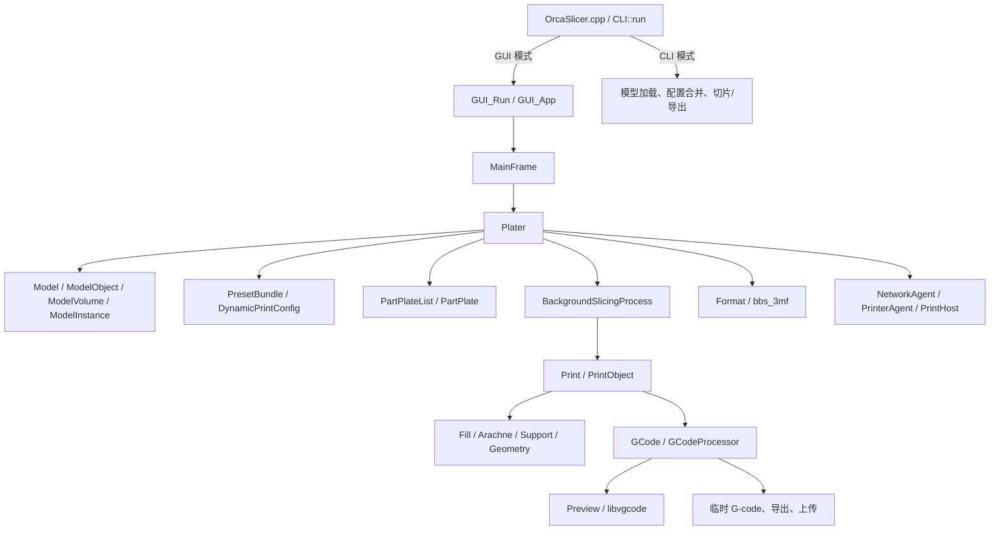
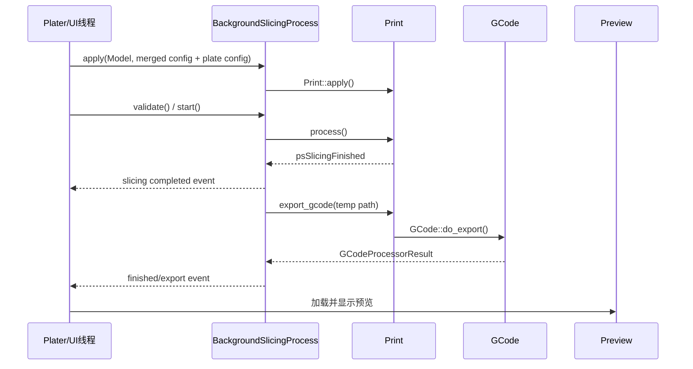

# OrcaSlicer 2.4.2 代码架构指南（面向开发 Agent）

本文用于帮助后续 Agent 在修改代码前快速建立完整心智模型。内容以当前仓库代码为准，重点描述模块边界、核心数据流、切片流水线、配置体系、线程约束和常见修改落点。

> 开发约束：保持 `.3mf`、打印机/耗材/工艺配置向后兼容；所有修改需兼容 Windows、macOS、Linux；功能开关关闭时不得改变原行为；优先复用已有类型和流程，避免在 GUI 与算法层之间复制逻辑。

配套的任务路由、实施手册、风险清单、检索命令和交接模板见 [`docs/agent/README.md`](docs/agent/README.md)。

## 1. 一分钟理解项目

OrcaSlicer 是一个 C++17 桌面切片器，整体可分为四层：

1. **启动与命令层**：解析 CLI，决定执行命令行任务还是启动 wxWidgets GUI。
2. **GUI 编排层**：管理窗口、工程、预设、盘、后台任务、预览和设备连接。
3. **领域状态层**：用 `Model` 表示工程几何，用 `DynamicPrintConfig`/`PresetBundle` 表示配置，用 `PartPlateList` 表示多盘状态。
4. **切片与输出层**：`Print`/`PrintObject` 完成 FFF 切片，`GCode` 生成 G-code，`SLAPrint` 处理 SLA 流程。



## 2. 仓库目录与职责

| 路径 | 职责 | 常见修改场景 |
| --- | --- | --- |
| `src/OrcaSlicer.cpp` | 程序入口、CLI 参数和无界面工作流 | 新增 CLI 行为、启动参数 |
| `src/libslic3r/` | 与 GUI 无关的核心领域模型、切片、格式和 G-code | 切片算法、配置定义、模型格式 |
| `src/slic3r/GUI/` | wxWidgets GUI、OpenGL 场景、工程编排 | 页面、交互、后台切片、预览 |
| `src/slic3r/Utils/` | 网络、打印主机、进程、平台辅助能力 | 新设备协议、HTTP、云服务 |
| `src/libvgcode/` | G-code 可视化库 | 预览渲染和轨迹显示 |
| `resources/profiles/` | 厂商、打印机、耗材、工艺配置 | 系统预设和兼容关系 |
| `resources/` | 图片、字体、着色器、翻译、Web 页面、校准数据 | UI 资源、内嵌网页、配置数据 |
| `tests/` | Catch2 测试 | 算法、格式、FFF/SLA 流程回归 |
| `deps/`, `deps_src/` | 依赖构建及依赖源码 | 仅在依赖升级时修改 |
| `cmake/`, `CMakeLists.txt` | 跨平台构建配置 | 新源文件、目标或依赖 |

核心构建目标关系：

- `libslic3r`：核心静态库，不依赖 GUI。
- `libslic3r_cgal`：CGAL/网格布尔等较重几何能力。
- `libslic3r_gui`：GUI 静态库，依赖 `libslic3r`、wxWidgets、OpenGL、libvgcode、网络库等。
- `OrcaSlicer`：最终入口；GUI 构建时链接 `libslic3r_gui`。
- Windows 另有 `OrcaSlicer_app_gui` 包装程序。

新增 `.cpp` 后必须同步加入相应的 `src/libslic3r/CMakeLists.txt` 或 `src/slic3r/CMakeLists.txt` 源文件列表。

## 3. 启动流程

### 3.1 统一入口

入口位于 `src/OrcaSlicer.cpp`：

```text
main / wmain
  -> CLI().run(argc, argv)
     -> CLI::setup() 解析参数
     -> 无 action：GUI_Run()
     -> 有 action：执行 CLI 模型加载、配置处理、切片或导出
```

`CLI::run()` 同时负责部分平台初始化，例如 UTF-8 文件系统、Linux 显示后端和临时目录。不要在更深层算法中重复处理进程级初始化。

### 3.2 GUI 启动

GUI 路径为：

```text
GUI_Run (GUI_Init.cpp)
  -> 创建 GUI_App
  -> 单实例检查
  -> wxEntry
  -> GUI_App::OnInit / on_init_inner
  -> 加载 AppConfig 与 PresetBundle
  -> 创建 MainFrame
  -> MainFrame 创建 Plater
```

主要文件：

- `src/slic3r/GUI/GUI_Init.cpp`：wxWidgets 启动桥接和单实例入口。
- `src/slic3r/GUI/GUI_App.cpp/.hpp`：应用级生命周期、全局服务、预设、语言、主题、登录、更新。
- `src/slic3r/GUI/MainFrame.cpp/.hpp`：顶层窗口、主 Tab、菜单和页面切换。
- `src/slic3r/GUI/Plater.cpp/.hpp`：编辑器核心协调器。

`wxGetApp()` 被广泛作为应用服务定位器使用。新增代码应尽量通过现有对象传递依赖；只有确实属于应用级单例的数据才继续挂到 `GUI_App`。

## 4. GUI 架构

### 4.1 `GUI_App`：应用级所有者

`GUI_App` 主要持有或管理：

- `AppConfig`：应用偏好和本地状态，不等同于切片配置。
- `PresetBundle`：打印机、工艺、耗材、SLA 材料等预设集合。
- `MainFrame` / 当前 `Plater`。
- `DeviceManager`、`UserManager`、`NetworkAgent` 等设备与账号服务。
- 语言、主题、字体、版本更新、网络插件、用户预设同步。

适合放在这里的逻辑：应用生命周期、跨页面全局状态、全局服务初始化。模型编辑或单次切片逻辑不应放入 `GUI_App`。

### 4.2 `MainFrame`：顶层页面容器

`MainFrame` 负责：

- Prepare、Preview、Device 等主页面的创建与切换。
- 顶层命令路由，如打开、保存、切片、导出。
- 根据当前 `Plater` 状态更新菜单和按钮可用性。

页面中的工程数据最终仍由 `Plater` 管理，避免在 `MainFrame` 再保存一份模型或切片状态。

### 4.3 `Plater`：工程与切片编排中心

`Plater::priv` 是当前 GUI 编辑器的核心状态聚合点，主要包含：

- `Model model`：当前工程模型。
- `Print fff_print` / `SLAPrint sla_print`：当前切片状态。
- `DynamicPrintConfig *config`：合并后的当前配置。
- `PartPlateList partplate_list`：多盘信息。
- `BackgroundSlicingProcess background_process`：后台切片线程协调器。
- `GCodeProcessorResult gcode_result`：G-code 解析结果。
- `View3D`、`Preview`、`Bed3D`、`Selection`、Gizmos、对象列表。
- 撤销/重做、工程脏状态、通知、后台 Job Worker。

因此大多数“用户操作 → 更新模型/配置 → 重新切片 → 刷新预览”的功能都应从 `Plater` 路径接入。

### 4.4 3D 场景与编辑工具

主要模块：

- `GLCanvas3D.*`, `3DScene.*`：OpenGL 场景、拾取和渲染。
- `Selection.*`：选中对象/实例/体积的状态与变换。
- `Gizmos/`：移动、旋转、缩放、切割、支撑涂色、接缝涂色等工具。
- `GUI_ObjectList.*`, `ObjectDataViewModel.*`：左侧对象树及其数据模型。
- `View3D.*`：Prepare 视图。
- `GUI_Preview.*`, `Preview.*`, `LibVGCode/`：切片结果预览。

对模型做变换时，应走现有 `Plater`/`Selection`/Gizmo 命令和快照流程，以维持撤销重做、脏状态、包围盒、盘归属和后台切片失效的一致性。

### 4.5 后台 Jobs

`src/slic3r/GUI/Jobs/` 用于耗时 GUI 任务，例如排版、自动定向、发送、打印、浮雕和模型导入。通用模式是：

- 工作线程执行耗时计算或网络任务。
- UI 更新通过 wxWidgets 事件或主线程回调完成。
- 任务必须支持取消，并避免在窗口销毁后访问 GUI 对象。

## 5. 核心领域模型

### 5.1 模型对象层级

定义集中在 `src/libslic3r/Model.hpp/.cpp`：

```text
Model
├─ materials: ModelMaterialMap
├─ objects: ModelObject[]
│  ├─ volumes: ModelVolume[]
│  │  ├─ TriangleMesh
│  │  ├─ ModelVolumeType（实体、负体积、参数修改体等）
│  │  ├─ 局部 DynamicPrintConfig
│  │  └─ 支撑/接缝/多材料/模糊表面涂色数据
│  ├─ instances: ModelInstance[]
│  │  └─ 位移、旋转、缩放、镜像和可打印状态
│  ├─ 对象级 DynamicPrintConfig
│  └─ 分层高度与 layer-range 配置
├─ plates_custom_gcodes
└─ 工程设计/作者等元数据
```

关键语义：

- `ModelObject` 表示一个逻辑对象。
- `ModelVolume` 表示对象内部的实体、负体积或参数修改区域。
- `ModelInstance` 表示同一对象的一个摆放实例；多个实例共享对象几何。
- `ObjectID` 用于增量同步、撤销重做和 `Print::apply()` 判断对象身份。复制/替换对象时不要随意破坏 ID 语义。

### 5.2 多盘模型

`PartPlateList`/`PartPlate` 位于 `src/slic3r/GUI/PartPlate.*`。它们将全局 `Model` 中的实例映射到不同打印盘，并保存盘级配置、耗材映射、临时 G-code、缩略图和切片结果状态。

需要注意：

- 工程仍以一个 `Model` 为主，不是每个盘一份独立模型。
- 切片时 `BackgroundSlicingProcess` 指向当前 `PartPlate`，并把盘级配置覆盖到合并配置上。
- 多盘坐标可能含 plate offset；几何算法若要求盘内坐标，应使用已有的去偏移辅助函数。
- 导出/发送时明确区分当前盘、指定盘和全部盘。

### 5.3 `Model` 到 `Print` 的转换

`Model` 是可编辑工程状态，`Print` 是适合切片的派生状态：

- `Print::apply(model, config)` 对比新旧模型和配置。
- 它创建/复用 `PrintObject`、`PrintRegion` 和 `PrintInstance`。
- 根据变更项只失效必要的处理步骤，以复用未变化的切片结果。
- `PrintObject` 可能按 Z 旋转等因素从同一 `ModelObject` 拆出多个切片对象。

不要直接把 GUI 的 `ModelObject` 当作已经切片的对象，也不要绕过 `Print::apply()` 修改 `Print` 内部状态。

## 6. 配置与预设体系

### 6.1 配置基础类型

- `src/libslic3r/Config.hpp/.cpp`：`ConfigOption`、`ConfigDef`、`ConfigBase`、`DynamicConfig`，负责类型化选项、序列化和兼容替换。
- `src/libslic3r/PrintConfig.hpp/.cpp`：打印相关的全部配置定义。
- `PrintConfigDef`：配置元数据的唯一权威来源，包括键名、类型、默认值、范围、枚举、GUI 文案等。
- `DynamicPrintConfig`：运行期稀疏配置，GUI、预设、对象覆盖和工程配置广泛使用。
- `PrintConfig`、`PrintObjectConfig`、`PrintRegionConfig`、`GCodeConfig` 等：算法层使用的静态强类型配置。

### 6.2 配置作用域与合并

典型来源按用途参与合并：

```text
默认配置
  + 打印机预设
  + 工艺预设
  + 一个或多个耗材预设
  + 工程配置
  + 盘级配置
  + 对象级配置
  + 高度范围/修改体配置
  -> Print / PrintObject / PrintRegion 的有效配置
```

实际合并由 `PresetBundle::full_config()`、`Plater` 更新流程和 `Print::apply()` 等共同完成。覆盖顺序敏感，新增选项前必须先明确它属于打印机、工艺、耗材、对象、区域还是盘级配置。

### 6.3 预设模型

定义在 `src/libslic3r/Preset.hpp/.cpp` 和 `PresetBundle.hpp/.cpp`：

- `Preset`：单个预设及其 `DynamicPrintConfig`。
- `PresetCollection`：同类型预设集合，处理选中、编辑、继承、兼容和保存。
- `PresetBundle`：聚合打印、耗材、打印机、SLA、物理打印机及项目内嵌预设。
- `VendorProfile`：厂商配置、型号、变体和继承关系。

预设来源包括系统资源、用户目录、订阅 Bundle、云同步和 `.3mf` 内嵌配置。不要假设所有预设都可写；系统预设、Bundle 预设和项目内嵌预设有不同覆盖规则。

### 6.4 新增配置项的完整检查清单

新增切片配置不能只改 UI，通常至少检查：

1. 在 `PrintConfigDef::init_fff_params()`、`init_common_params()` 或 `init_sla_params()` 定义键、类型、默认值、范围和作用域。
2. 将强类型字段加入正确的静态配置类组合。
3. 在 `Print::apply()`/`PrintObject::invalidate_state_by_config_options()` 附近建立正确的失效映射。
4. 在 `Tab.cpp`、`ParamsPanel.cpp`、`OptionsGroup.cpp` 等现有配置页面中暴露 UI。
5. 在切片/G-code 代码读取正确作用域的最终值。
6. 若写入 profile 或 `.3mf`，处理旧版本缺省值、重命名和 `handle_legacy()` 迁移。
7. 选项关闭时保持原算法路径和输出不变。
8. 检查 CLI、项目内嵌预设、多耗材数组长度以及打印机兼容筛选。

## 7. FFF 切片流水线

主入口在 `src/libslic3r/Print.cpp` 的 `Print::process()`。对象级步骤由 `PrintObjectStep` 跟踪，全局步骤由 `PrintStep` 跟踪。

### 7.1 对象级步骤

大致执行顺序如下：

```text
posSlice
  -> posPerimeters
  -> posEstimateCurledExtrusions
  -> posPrepareInfill
  -> posInfill
  -> posIroning
  -> posContouring
  -> posSupportMaterial
  -> posDetectOverhangsForLift
  -> 路径简化相关步骤
```

当前实现中的主要调用：

- `PrintObject::make_perimeters()`：切层并生成墙/周长；墙生成会进入 `PerimeterGenerator` 或 `Arachne`。
- `PrintObject::estimate_curled_extrusions()`：卷边风险相关计算。
- `PrintObject::infill()`：准备并生成实体/稀疏填充。
- `PrintObject::ironing()`：熨平路径。
- `PrintObject::contour_z()`：Z 轮廓处理。
- `PrintObject::generate_support_material()`：普通或树状支撑。
- `PrintObject::detect_overhangs_for_lift()`：悬垂与抬升相关处理。
- `PrintObject::simplify_extrusion_path()` 等：输出前路径简化。

对象间可复用相同几何的切片结果；部分支撑步骤通过 TBB 并行执行。对共享对象或并行容器的修改必须明确所有权与线程安全。

### 7.2 全局步骤

```text
psWipeTower / psToolOrdering
  -> psSkirtBrim / psSlicingFinished
  -> psGCodeExport
  -> psConflictCheck
```

- `psWipeTower` 同时承担多材料工具顺序和擦料塔数据构建。
- `psSkirtBrim` 生成裙边、brim 和首层凸包；完成后视为切片几何已就绪。
- `psGCodeExport` 由 `Print::export_gcode()` 进入 `GCode::do_export()`。
- 配置或模型变化会让当前步骤及其下游步骤失效。

### 7.3 G-code 生成

主要文件：

- `src/libslic3r/GCode.cpp/.hpp`：分层遍历、路径排序、挤出、换料、模板输出。
- `src/libslic3r/GCodeWriter.*`：低层 G-code 指令写入。
- `src/libslic3r/GCode/ToolOrdering.*`：逐层工具顺序。
- `src/libslic3r/GCode/WipeTower*.{cpp,hpp}`：擦料塔。
- `src/libslic3r/GCode/SeamPlacer.*`：接缝放置。
- `src/libslic3r/GCode/GCodeProcessor.*`：解析生成结果，提供时间、耗材和预览数据。
- `src/libslic3r/GCode/*Buffer*`, `PressureEqualizer`, `SpiralVase`, `PostProcessor`：输出过滤和后处理链。

典型流程：

```text
Print::export_gcode
  -> GCode::do_export
  -> 收集并排序各对象/支撑层
  -> 生成逐层挤出和移动
  -> 冷却、压力、风扇、螺旋等过滤器
  -> 写临时 G-code
  -> GCodeProcessorResult
  -> 预览、最终导出或上传
```

### 7.4 多色共挤 C 轴扩展

专项模块位于 `src/libslic3r/CoExtrusion/`，不要把色区、法线或延迟逻辑继续堆入 `GCode.cpp`：

```text
ModelVolume::coextrusion_surface_colors
  -> TriangleMeshSlicer face provenance / SurfaceSliceSidecar
  -> SurfacePathMatcher
  -> CAxisIntentBuilder / SurfaceDirectionResolver
  -> DelayCompensator
  -> CAxisMotionPlanner
  -> GCodeWriter XYEC / XYZEC
  -> GCodeProcessor metadata
  -> LibVGCodeWrapper / PathVertex
```

当前实现状态、配置格式和边界分别见
[`C_AXIS_COEXTRUSION_IMPLEMENTATION_STATUS.md`](docs/agent/C_AXIS_COEXTRUSION_IMPLEMENTATION_STATUS.md) 与
[`COEXTRUSION_CONFIGURATION_AND_VERIFICATION.md`](docs/agent/COEXTRUSION_CONFIGURATION_AND_VERIFICATION.md)。

## 8. GUI 后台切片数据流

`BackgroundSlicingProcess` 位于 `src/slic3r/GUI/BackgroundSlicingProcess.*`，是 UI 与 `Print` 之间的线程边界。



状态机为 `INITIAL -> IDLE -> STARTED -> RUNNING -> FINISHED/CANCELED -> IDLE`，退出时进入 `EXIT/EXITED`。

线程规则：

- `Print::process()` 和 G-code 生成运行在后台线程。
- wxWidgets 控件只能在 UI 线程访问。
- 后台完成通知使用 `wxQueueEvent`/`CallAfter`。
- `Print::apply()` 修改数据前可能通过取消回调停止正在使用这些数据的后台任务。
- 不要在持有切片状态锁时同步等待 UI 做可能回调切片状态的操作，避免死锁。
- 取消路径是正常控制流；新增循环应定期调用已有取消检查。

## 9. 文件导入、工程与持久化

### 9.1 模型导入

统一入口是 `Model::read_from_file()`，按扩展名路由到 `src/libslic3r/Format/`：

- STL：`STL.*`
- OBJ：`OBJ.*`, `objparser.*`
- STEP：`STEP.*`
- AMF：`AMF.*`
- 3MF：`3mf.*` 和 Orca/Bambu 工程格式 `bbs_3mf.*`
- SLA 包：`SL1.*`

GUI 中的项目加载和普通模型导入由 `Plater::priv::load_files()` 一带协调。项目加载不仅包含网格，还可能更新预设、盘、耗材、工程配置、缩略图和自定义 G-code。

### 9.2 `.3mf` 是兼容性边界

Orca/Bambu 工程主要由 `src/libslic3r/Format/bbs_3mf.cpp/.hpp` 负责。它是大型 ZIP/XML 序列化模块，内容可能包括：

- 模型与实例变换。
- 对象/体积/高度范围配置。
- 多盘布局和盘级数据。
- 项目预设、耗材映射和自定义 G-code。
- 缩略图、切片信息、可选 G-code。
- 设计者和工程元数据。

修改格式时必须：

- 保持旧字段可读，新字段缺失时提供稳定缺省行为。
- 字段重命名走兼容映射，不直接删除旧键。
- 区分普通 3MF、Prusa 3MF、Bambu 3MF 和 Orca 3MF。
- 同时检查导入与导出、仅加载模型与加载完整工程、单盘与多盘。
- 避免让新字段成为打开旧工程的必需项。

### 9.3 工程保存

GUI 保存入口为 `Plater::export_3mf()`，最终进入 BBS 3MF 导出器。`SaveStrategy` 控制静默保存、备份、拆分模型、包含 G-code、跳过模型等变体。自动备份、发送打印和用户主动保存使用的策略不同，新增数据必须确认需要在哪些策略下写入。

## 10. 算法模块索引

| 需求 | 首选目录/文件 |
| --- | --- |
| 墙、可变线宽 | `libslic3r/PerimeterGenerator.*`, `libslic3r/Arachne/` |
| 填充图案 | `libslic3r/Fill/`，工厂入口 `Fill/Fill.*` |
| 普通/树状支撑 | `libslic3r/Support/`, `TreeSupport*` |
| 层数据与表面分类 | `Layer.*`, `LayerRegion.*`, `Surface.*`, `SurfaceCollection.*` |
| 挤出路径表示 | `ExtrusionEntity.*`, `ExtrusionEntityCollection.*` |
| 多边形布尔/偏移 | `ClipperUtils.*`, `clipper.*`, `Geometry/` |
| 网格处理 | `TriangleMesh.*`, `MeshBoolean.*`, `libslic3r_cgal` |
| 排版 | `Arrange.*`, GUI 的 `Jobs/ArrangeJob.*` |
| G-code 主流程 | `GCode.*`, `GCodeWriter.*`, `GCode/` |
| 冲突检测 | `GCode/ConflictChecker.*` |
| SLA | `SLAPrint.*`, `SLA/`, `Format/SL1.*` |
| 校准 | `calib.*`, GUI 的 `Calib*`, `resources/calib/` |
| 多色共挤 C 轴 | `libslic3r/CoExtrusion/`, `GCodeWriter.*`, `GCodeProcessor.*`, `LibVGCodeWrapper.*` |

几何内部大量使用缩放整数坐标。遇到 `scale_()`/`unscale()`、`coord_t`/`coordf_t` 时，不要混用毫米浮点坐标和内部整数坐标。

## 11. 设备、网络与发送

设备能力主要位于：

- `src/slic3r/Utils/NetworkAgent*`：网络服务抽象与实现选择。
- `IPrinterAgent.hpp`, `*PrinterAgent.*`：厂商/协议打印机代理。
- `PrintHost.*` 及 `OctoPrint`, `Moonraker`, `Duet`, `Repetier`, `MKS` 等：打印主机上传。
- `src/slic3r/GUI/DeviceCore/`, `DeviceTab/`, `Monitor*`, `SendToPrinter*`：设备 UI。
- `src/slic3r/GUI/Jobs/SendJob.*`, `PrintJob.*`：发送和打印后台任务。

协议层不应依赖具体 GUI 控件。网络回调可能来自非 UI 线程，更新界面前必须投递到主线程；对象销毁时应先停止订阅/线程再释放回调目标。

## 12. 资源与系统预设

`resources/profiles/` 下的厂商 JSON 描述厂商、机器型号、喷嘴变体及配置目录。实际打印机/耗材/工艺预设通过继承和兼容表达式组合。

修改 profile 时注意：

- 继承链中的父配置可能来自其他文件。
- 打印机、工艺、耗材间存在兼容条件，不是仅靠名称匹配。
- 多喷嘴/多耗材选项通常是数组，长度需与有效挤出机或耗材数一致。
- 系统 profile 是用户 profile 的父级，改默认值会影响大量用户。
- 配置 key 必须先在 `PrintConfigDef` 中存在并能被旧版本/新版本安全反序列化。

其他资源：

- `resources/i18n/`：翻译资源。
- `resources/images/`, `fonts/`, `shaders/`：桌面 UI 和渲染资源。
- `resources/web/`：Home、Guide、设备等内嵌 WebView 内容。
- `resources/printers/`：打印机相关附加资源。

## 13. 增量失效与缓存：最容易引入隐蔽错误的区域

`PrintBase`/`PrintObjectBaseWithState` 为每个步骤保存状态和时间戳。配置变更不会总是全量重切，而是通过选项键映射到受影响步骤。

修改算法或新增选项时，必须回答：

1. 它影响对象切层、墙、填充、支撑、擦料塔、裙边还是仅 G-code？
2. 上游数据变化后，哪些下游缓存必须清空？
3. 仅改变显示是否真的需要重切？
4. 多个 `PrintObject` 共享切片结果时，缓存还能否安全复用？
5. 从已有 G-code/缓存恢复时，新数据是否存在？不存在时如何回退？

失效不足会产生“首次正常、改参数后错误”的陈旧缓存 bug；失效过度则会导致不必要的全量重切。

重点阅读：

- `Print.cpp` 开头的配置键到 `PrintStep`/`PrintObjectStep` 映射。
- `Print::invalidate_step()`。
- `PrintObject::invalidate_state_by_config_options()` 和 `invalidate_step()`。
- `Print::apply()` 的模型/配置差异同步。

## 14. 常见需求的修改落点

### 新增一个切片参数

```text
PrintConfigDef 定义
  -> 静态配置字段/作用域
  -> Preset/项目序列化
  -> Tab/ParamsPanel UI
  -> Print::apply 失效映射
  -> PrintObject/GCode 算法读取
```

### 修改墙或填充算法

从 `PrintObject::make_perimeters()` 或 `PrintObject::infill()` 向下追踪；优先把纯算法放在 `libslic3r`，只把开关和状态展示放在 GUI。确认旧开关路径完全不变。

### 修改预览表现

先判断需求属于：

- 生成数据错误：改 `GCode`/`GCodeProcessor`。
- 预览数据转换错误：改 `GUI_Preview`/`Preview`/`LibVGCodeWrapper`。
- 纯渲染错误：改 `libvgcode` 或 GL shader。

不要用渲染层补丁掩盖 G-code 生成错误。

### 新增导入格式

在 `libslic3r/Format/` 实现无 GUI 的解析器，接入 `Model::read_from_file()` 路由，再在 `Plater` 文件选择器和加载策略中开放。错误通过已有异常类型返回，由 GUI 决定展示。

### 新增打印机连接方式

优先实现/扩展 `PrintHost` 或 `IPrinterAgent` 抽象，然后接入发送 Job 和设备 UI。保持协议层可在无 GUI 情况下使用。

### 修改工程字段

同时定位 `bbs_3mf` 的导入器、导出器、版本判断和 GUI 加载后的应用逻辑。设计可选字段和旧文件回退路径，不要只修改写入端。

## 15. 跨平台与并发注意事项

- 路径优先使用现有 Boost/nowide 辅助函数，Windows 文件名不能假设本地窄字符编码。
- 平台差异使用仓库现有宏风格：`_WIN32`/`__WINDOWS__`、`__APPLE__`、`__WXGTK__` 等；先查看相邻代码所用宏。
- macOS 有 Objective-C++ `.mm` 实现，Windows 有资源、包装程序和 dark mode 实现，Linux 涉及 GTK、Wayland/X11、WebKit、GStreamer。
- 核心算法使用 TBB；GUI 后台任务还使用 Boost thread、`std::thread`、互斥量和 wx 事件。
- 不要从工作线程直接读写 wx 控件，也不要捕获生命周期短于任务的裸窗口指针。
- 修改并行循环时，区分对象私有数据、只读共享数据和需要同步的全局数据。
- 取消、窗口关闭和切换工程可能同时发生；耗时任务必须使用已有取消/销毁顺序。

## 16. 测试目录导航

虽然后续 Agent 是否执行测试取决于任务要求，但修改点对应的测试位置如下：

- `tests/libslic3r/`：几何、配置、模型、格式和算法单元测试。
- `tests/fff_print/`：FFF 切片与 G-code 行为。
- `tests/sla_print/`：SLA 流程。
- `tests/slic3rutils/`：工具和网络辅助能力。
- `tests/data/`：测试模型和配置数据。
- `tests/libnest2d/`：排版算法。

高价值回归场景通常是：默认配置、开关关闭、开关开启、参数修改后的二次切片、保存后重开 `.3mf`、多盘/多耗材。

## 17. 后续 Agent 推荐工作方式

1. 先读根目录 `AGENTS.md` 和任务涉及目录中的说明文件。
2. 用 `rg` 从用户可见入口追到状态所有者，再追到算法；不要只按文件名猜测。
3. 明确数据的唯一所有者：`Model`、`PresetBundle`、`PartPlate`、`Print` 或 GUI 控件。
4. 明确线程：UI、后台切片、TBB 算法任务或网络回调。
5. 明确持久化边界：是否进入 profile、AppConfig、`.3mf` 或 G-code。
6. 明确失效边界：参数变化后应重算到哪一步。
7. 做最小修改，沿用附近代码风格和现有辅助函数。
8. 新行为受选项控制时，先保护旧路径，再实现新路径。

## 18. 建议阅读顺序

针对一般功能开发，按以下顺序阅读效率最高：

1. `src/OrcaSlicer.cpp` 中 `CLI::run()`。
2. `src/slic3r/GUI/GUI_Init.cpp` 和 `GUI_App::on_init_inner()`。
3. `MainFrame` 创建 `Plater` 的代码。
4. `Plater::priv` 的数据成员和当前任务相关事件处理。
5. `Model.hpp` 的对象层级。
6. `PrintConfig.hpp/.cpp` 和 `Preset.hpp`。
7. `BackgroundSlicingProcess::apply()`、`process_fff()`。
8. `Print::apply()`、`Print::process()`。
9. 任务对应的 `PrintObject`、`Fill`、`Arachne`、`Support` 或 `GCode` 子模块。
10. 如果涉及工程文件，再阅读 `Model::read_from_file()`、`Plater::export_3mf()` 和 `Format/bbs_3mf.*`。

## 19. 架构判断原则

- **GUI 负责意图和展示，`libslic3r` 负责可复用业务与算法。**
- **`Model` 是编辑态真相，`Print` 是可失效、可重建的切片派生态。**
- **配置定义以 `PrintConfigDef` 为真相，预设只是配置的来源和组织形式。**
- **多盘是全局模型上的分组和盘级覆盖，不是独立工程。**
- **G-code 预览应源自实际输出数据，避免形成第二套切片逻辑。**
- **兼容、取消、增量失效和线程所有权属于功能实现的一部分，不是事后补充。**
