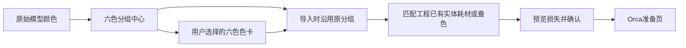

# 3D 美颜与导入配色体验改进

本轮范围为用户提出的五项体验问题。协同分支与飞书由另一个会话处理，本记录不改变协同设置。

## 结论与实现

### 图片背景

移除“查看原始AI图”的开关及技术警告，默认优先历史展示副本；新结果优先显示模型参考图，其次清理预览。原始生成图仍独立归档，展示副本不能成为供应商输入。透明图片在画布上用纯灰底衬托主体，没有绘制棋盘。

新任务已有纯色背景提示和 opaque 请求，本轮补充三类风格、文生图与图生图的离线回归。需要区分：透明底的棋盘是显示方式，而历史图片中已画入RGB的棋盘是真实像素。已有清理副本默认使用；没有可靠遮罩的旧图无法同时承诺无棋盘和零主体误删。本轮不对所有白色主体执行不可靠的全图颜色替换，也不偷偷替换生成输入。

### 六色为什么看起来更多

旧着色器先选六个基础色，再乘连续光照，所以出现许多深浅RGB。本轮默认纯分色色块，关闭这次绘制的多重采样和抖动，结束后恢复GL状态；用户可选择立体光照展示。选区高亮属于编辑标记。原始色值统计仍描述文件自身，不能当作耗材数量。

试色通过 `ModelImportRequest.color_trial` 传递，两组色板分别保存原始分组中心和用户修改后的输出色。它不覆盖不可变生成原件或旧颜色意图清单。导入按原分组中心分类再输出新色，不因用户把红色改蓝而重新划分模型区域。

### 工作台与重新开始

移除高级工具独立入口及重复重新设计区。整体美颜、局部修整、六色试色、网格修复、局部改色集中到工作台。重新开始提供直接开始、先看建议、留在作品；已有质量建议可复用，没有检查报告时明确显示一般设计建议。不会自动发起收费AI检查或生成。

修正工具间选区模式残留、改色保存前丢选区、导入后再改色的新版本不可再次导入、局部改色后回退原始棋盘图等状态问题。

### 美颜方法与性能

沿用法线约束Taubin柔化，局部操作只建立选区边表与法线，并仅迭代活动顶点；三圈边界渐变降低选区边缘接缝。取消覆盖哈希、处理和写出。原件、未选顶点、UV、色彩、材质和面序保持。

同一1906896面／953446顶点人物、1803面选区、强度15，包含OBJ读写与哈希，3次处理中位数由12016ms降至6986ms，减少约42%。不是完整GUI端到端耗时。新结果移动833顶点，未选面顶点变化0，选区翻面0，非顶点行变化0，原件SHA未变。

### 原生导入配色

原生初次自适应分色原来与六色预览无关联，且色差较大时会建议新增实体耗材。现在AI导入默认以六个目标色开始，启用试色则沿用固定两组色板并跳过二次聚类和边界清理；只使用已有工程耗材。已有超过六槽的工程保留原配置并显示提示。

窗口提供点击保持的原始颜色／目标分色／耗材效果，分别显示目标颜色、实体耗材、叠色和新增项。纯RGB目标与真实耗材效果分开确认。普通文件导入仍保留中性选项及既有算法默认。

当前配方是CMYW／RYBW，不能改名声称实现CMYK材料标定。实际CMYK叠色仍需相应材料配方和色卡；最终打印色、换料成本不能仅由屏幕预览证明。固定色板的面采样与GPU片元采样在边界上也不保证逐像素相同。

## 开源调研与选型

| 方案 | 可参考能力 | 决定 |
|---|---|---|
| [Open3D](https://open3d.org/docs/release/python_api/open3d.geometry.TriangleMesh.html) / [MIT](https://github.com/isl-org/Open3D/blob/main/LICENSE) | Taubin保形柔化、ARAP | 本轮复用现有实现，不新增整套运行时；ARAP适合未来带锚点形变 |
| [libigl](https://libigl.github.io/tutorial/) | 拉普拉斯／Hessian平滑、边界条件 | 参考局部边界设计；模块许可需区分，不为单项操作引入求解器 |
| [CGAL](https://doc.cgal.org/5.0/Polygon_mesh_processing/group__PMP__meshing__grp.html) / [许可](https://www.cgal.org/license.html) | 约束顶点与选区曲面处理 | 保留现有核心能力，避免百万面无必要结构转换 |
| [Oklab](https://bottosson.github.io/posts/oklab/) | 感知距离、公开矩阵 | 统一试色与固定分组，亮度权重0.35 |
| [libimagequant](https://pngquant.org/lib/) | 固定色、重要区域、有限色量化 | 作为后续对照算法，当前已有面积加权量化可用，不加新依赖 |
| [rembg](https://github.com/danielgatis/rembg) | 自动背景移除 | 代码MIT与权重许可不同，首次下载和边缘误删有成本，不作默认依赖 |
| [OpenCV GrabCut](https://docs.opencv.org/4.13.0/d8/d83/tutorial_py_grabcut.html) | 无大模型的交互前景分割 | 可能需要用户修正白衣、头发，不无条件自动改生成原图 |

更详细的分色、耗材和配方研究见同目录 `2026-09-09-native-color-import-chain.md`。

## 验证记录

独立几何测试14项／4072断言通过；独立色板测试11项／299断言通过；背景2项回归覆盖6子场景通过，所有供应商调用显式mock。真实模型基准见 `.tmp/beauty-geometry-20260909`。

Windows Release程序及两个相关测试程序构建通过。最终slic3rutils组合回归53项／4719断言通过，原生分色9项／902断言通过。提前链接旧GUI库时的一次美颜断言失败不作为新版结论；完整新库链接后同随机种子9092026重跑通过，日志分别保留在`.tmp/ux-performance-20260909`。

补充修复：改色副本写出后恢复源编辑器颜色，避免回退后的再次改色污染；局部改色接入版本回退／重做；工具栏放在右侧独立滚动；重新开始恢复当前历史作品的参考图。透明参考图与AI图均使用只在画布绘制的纯灰底。

主窗口验证已覆盖透明白色主体在灰底可辨认、历史清理图默认展示、六色平涂与光照切换、局部美颜2485面预览和处理前对照／放弃、局部改色68482面保存及版本回退／重做。局部改色后原始色值从39863变为38581，回退恢复39863，重做恢复38581；原图与AI图仍正确恢复。

原生配色实际收到六个工作台目标色，界面显示使用4个已有实体耗材、0个叠色配方、新增0。取消后作品和试色保留；取消前后导出的3MF所有同名归档条目逐字节一致，准备页没有留下对象或新增耗材。重新开始建议返回保留作品；直接开始恢复当前人物参考图，不沿用之前透明测试图。真实界面还发现导入默认视角偏向侧后方，已将AI导入的复位视角对齐工作台正面，普通导入默认视角不变。

最终构建的正面视角已在主窗口确认，固定六色的目标分色页与耗材光照页可以点击保持。确认配色后模型进入准备页、自动摆放完成，切片和G-code均等待手动操作。保存的`final-six-color-import.3mf`中打印机、工艺、四个耗材配置ID及颜色与导入前完全一致。原始人物OBJ的SHA256仍为`bbb5929a852be262457cd3527d495bb143b64df071d11f60e90a87614233e390`，透明测试图仍为RGBA、alpha范围0..255。

同一原始OBJ通过普通Ctrl+I入口回归：按旧自适应算法得到3色、边界清理5，参数可调整，不继承AI固定六色或正面约定。取消该导入后回到已有工程；应用留在局部美颜工作台供继续体验。这里的普通导入回归不代表全平台、全格式覆盖。

最终运行库SHA256为`aefbcf1ce875124e1044e2ef23bfa396fde725de3579031a2c8ddf550593fe50`。主窗口截图和工程保存在`.tmp/ux-performance-20260909/final-native-six-color.png`、`final-import-preparation.png`及`final-six-color-import.3mf`。

架构检查新增预算超限通过将AI状态展示移回桌面AI层修复；原有四项检查问题仍单列保留（两处测试凭据字面量、两条历史来源分支缺失），没有放宽检查或制造历史ref。屏幕与离线测试不构成CMYK实际打印标定，也没有执行新的付费图片／3D生成。
