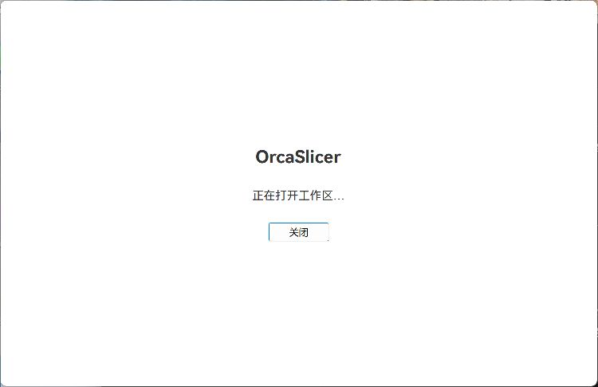
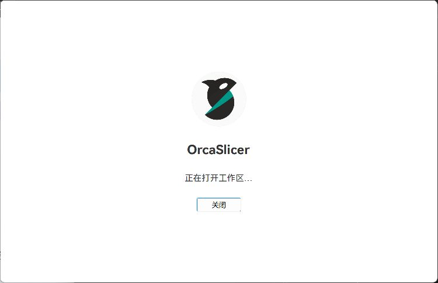

# 本地生成服务与加载图标修复

## 原因与修改

验证时工作目录为 `D:/TEST/OrcaSlicer-maintenance`，在 maintenance 分支 `077f97f6a44ce1f90f9165f80f2cafb392cce73d` 及上一轮未提交的启动修复基础上继续修改。整理 PR 时已重新核实：该基线文件树与 integration 的 `7b6b270349a48d5b85a3c74a934f89c84da1c8ad` 完全一致。本次改动从后者建立独立分支 `codex/maintenance/startup-loading-runtime`，目标为 `codex/team/integration`。

下文构建哈希和测试记录对应提交前已验证的代码快照；PR 整理仅补充文档与截图，没有改动已验证的 C++、中文翻译和交付脚本。`build/` 中日志、配置和其他截图仅在本机留存，不随 PR 上传。文档附件中的关键截图可以在 GitHub 查看。

用户 12:08 的真实运行日志记录了 `Packaged AI sidecar runtime is unavailable; python=true, bootstrap=false`。此前交付的开发构建关闭了 `ORCA_AI_WINDOWS_INSTALLER`，并未执行 CMake install，缺少 Sidecar/启动脚本、生成的版本身份与依赖清单，以及 Pillow。work 中两个旧 portable 包均有这些内容；它们和开发构建使用的 Python 都是 3.12.13，旧包的 Pillow 为 12.2.0。三者均无 NumPy，不能把此次服务问题归因于 NumPy。

上一轮验证覆盖了启动画面与普通切片，没有验证本地生成服务就绪；主 EXE 编译成功不能代表完整 AI 运行环境已经交付。

本轮使用当前源码和既有 CMake 安装规则生成独立完整运行目录 `build/local-startup-preview`。该目录的资源为实体文件；不向开发构建的 `resources` Junction 写入服务脚本。保留原 work 版本、真实用户配置、服务协议、端口和认证规则；交付包不包含供应商凭据。

启动遮罩与首页等待/失败页共用原生图标和产品标题，复用现有 `OrcaSlicer_gradient_circle.svg`，按 96 DIP 绘制。新增 Windows DPI 重绘处理；图标和文字均参与同步绘制。保留阶段提示、关闭、重试、进入准备页及兄弟裁剪，不增加动画或百分比。

## 验证规则

- 单测与离线模拟使用当前源码，并通过网络限制与 mock 阻止真实供应商调用。
- GUI 测试从完整运行目录启动，使用 `build/startup-validation` 内的独立 datadir。
- 测试启动器只将已有且受支持的 User 环境变量补充到自身子进程环境，不修改 User/Machine 配置，不打印值。
- 本地服务就绪、协议握手和离线生成模拟分别记录；不把这些结果写成真实收费生成通过。

## 验证结果

### 完整运行环境预检

GUI 重编译期间，先通过 CMake install 补齐既有 `build/startup-validation/runtime` 测试副本。该预检使用上一轮的原生主 DLL（本轮没有修改服务 C++ 代码），配合当前源码的服务脚本和生成的身份文件；不作为最终带图标版本的验收结果。

- 包内 Python 3.12.13 / Pillow 12.2.0 隔离导入及原生 PNG 往返成功。
- 预检程序 PID 11132 自动启动 Sidecar PID 42628；日志记录会话保护开启、Sidecar 版本 v9、当前源码提交和本地 package revision。
- 会话挑战、认证 health 和本地 latest-job 查询均返回 200。实际“3D 生成”页面显示“本地 3D 生成服务已就绪”。
- 读取已有用户配置后，服务报告图片服务与 Tripo 已配置；没有发起生成任务或外部供应商验证。
- 程序正常退出码为 0，Sidecar 子进程随之退出，18764 端口释放。运行时长包含人工操作和等待，不是启动基准。
- 证据：[预检服务就绪](../../build/startup-validation/service-preflight-ready.png)、`build/startup-validation/home/log/orca-ai-sidecar.log`、该目录内 PID 11132 的运行结果记录。
- 失败恢复预检：用仅监听 loopback 的 404 夹具占用服务端口，PID 37988 显示“本地生成服务未启动”和“重新检测服务”；停止夹具后点击重新检测，自动启动 Sidecar PID 37500，挑战、health 与 latest-job 均返回 200，页面恢复“已就绪”。正常退出码 0，子进程退出且端口释放。[失败状态](../../build/startup-validation/service-preflight-unavailable.png)、[恢复状态](../../build/startup-validation/service-preflight-recovered.png)。

### 离线测试

- 当前源码 58 项定向 Python 测试全部通过，0 失败、0 错误、0 跳过，用时 1.971 秒；覆盖启动器、gateway、生成请求、预处理失败、恢复和防重复任务。
- 测试通过网络 audit guard 拒绝外网，清除供应商环境并使用 mock。运行环境为系统 Python 3.12.10 / Pillow 12.2.0，不冒充最终包内 Python 的执行结果。
- 可复现命令和结果见 `build/startup-validation/targeted-runtime-tests-20260914.md`。上一轮 C++ 测试结果仍在启动修复报告中，本轮没有把它们计为重新执行。
- `scripts/test_stage_local_ai_runtime.ps1`：26 项离线夹具测试通过，0 失败。包含缺少 bootstrap、身份文件、Pillow 原生模块，以及 DLL/中文资源变动、外来目录和资源链接保护。日志见 `build/local-runtime-logs/script-tests.log`。
- 最终 `python scripts/verify_ai_integration.py --json` 通过，`ok=true`、`errors=[]`，保留 Git 检查；`git diff --check` 通过，仅有仓库既有 LF/CRLF 转换提示。

## 重复构建与交付检查

在当前维护工作目录中执行：

```powershell
powershell -NoProfile -ExecutionPolicy Bypass -File scripts/stage_local_ai_runtime.ps1
```

该命令启用 AI 运行时配置，构建 Release、编译简繁中文资源，再用 CMake install 生成实体运行目录。它验证安装清单、当前服务脚本、固定 Python/Pillow、版本身份以及隔离 Python 原生图像处理。输出目录必须是本构建目录的专用直接子目录，非空外来目录会被拒绝，不会递归清空或覆盖旧工作区。

只重新检查已有交付目录：

```powershell
powershell -NoProfile -ExecutionPolicy Bypass -File scripts/stage_local_ai_runtime.ps1 -VerifyOnly
```

成功记录为 `.local-runtime-verified.json`；检查开始后撤销旧成功记录，只有所有检查通过才重建。`.local-runtime-owner.json` 标识目录归属，`.local-runtime-build.json` 保存构建来源、安装清单和哈希。源码证明的范围是脚本列出的启动相关文件，不宣称覆盖任意其他 C++ 改动。上述命令不设置供应商密钥、不提交代码、不发布安装包。

### 最终版本

完整运行入口：`D:/TEST/OrcaSlicer-maintenance/build/local-startup-preview/orca-slicer.exe`。需要保留同目录 DLL、Python 和 resources，不能只复制 EXE。此前 `build/src/Release` 是开发构建入口，本轮以完整运行目录作为交付。

- Release 构建、CMake install 和独立 `VerifyOnly` 均成功，包内 Python 3.12.13 / Pillow 12.2.0 的隔离原生 PNG 往返通过。
- 构建记录核对 17,041 个安装文件，保存 1,052 个原生/Python 文件哈希、15 个启动相关源码与构建文件指纹、3 个图标/中文资源指纹。
- `OrcaSlicer.dll` 为 108,324,352 字节，SHA256：`538C1C8F000177E242350ED8E377E66A3BC0B89D62E3E43C2CD2140F5D530232`。
- EXE SHA256：`3703E416740B1B7B8113BD4C804FEC5025B00CBC461990FF87DAAFD8FCD1FA45`。
- 为补齐 uv 打包依赖，本次触发 GUI 库重编；构建有既有 LNK4098 CRT 默认库冲突提示及 LTCG 提示，没有编译/链接错误。原长构建完成后，以新版脚本执行增量构建与安装，补齐目录归属及构建证明，未混用旧服务代码。
- 命令、构建日志和一次性归属记录见 `build/startup-build-commands.txt`、`build/local-runtime-logs/`、运行目录中的三份 `.local-runtime-*.json`。

| 实际检查 | 结果与证据 |
|---|---|
| 浅色加载、关闭 splash | 从最终目录启动，PID 19148 实际显示 Orca 图标、产品名称和“正在打开工作区…”；随后显示准备页与导入模型。图标和提示没有被侧栏遮挡 |
| 本地服务自动启动 | PID 19148 自动启动最终目录的 Sidecar PID 42180；会话挑战、health 和 latest-job 返回 200，实际“3D 生成”页面显示“本地 3D 生成服务已就绪”。供应商仅检查配置存在性，没有发起收费请求 |
| STL 导入、手动 GUI 切片 | 打开 `20mmbox-CRLF.stl`，显示 20×20×20 mm、12 三角面；手动切片后进入预览，249 层，显示时间与耗材 |
| 独立 CLI 切片 | 最终 EXE 打开已有 `startup-cube.3mf`，退出码 0；生成 595,477 字节、249 层的 G-code。命令、配置、哈希和输出见 `build/startup-validation/final-cli-slice-20260914/validation.md` |
| 重复启动与退出 | 最终目录的 PID 32200 正常进入首页，PID 33804 正常进入准备页；PID 19148、32200、33804 均正常退出，退出码 0。服务进程随主程序退出，端口释放 |
| 启动中关闭 | 最终目录 PID 27548 在初始化期间收到关闭操作；日志有正常 shutdown、没有 `workspace_revealed`，退出码 0，退出后无服务监听。此前 PID 32200、33804 的操作晚于就绪，仅算正常启动/退出，不计入此项 |
| 深色首页加载与超时 | 从最终目录复制的实体测试副本运行 PID 12192，DLL 哈希与最终版本一致。仅测试副本的首页使用 loopback 延迟夹具；实际显示深色 Orca 品牌加载页，可见等待 10,029 ms 后显示中文超时提示及两个入口 |
| 超时后进入准备页 | 点击“进入准备页面”后可使用普通准备页；返回首页仍保留超时操作状态 |
| 超时后重试 | 恢复测试副本正常首页后点击“重试”，273 ms 记录主文档就绪，实际首页恢复。测试结束后正常退出码 0，慢资源夹具及 Sidecar 均退出 |

随 PR 保存的界面证据：

| 上一轮文字加载界面 | 本轮加入 Orca 图标 |
|---|---|
|  |  |

此对比展示图标美化前后；上一轮已经包含中文加载提示，不将它标成最初的纯白屏。

- [最终版本服务就绪](assets/2026-09-14-startup/final-brand-service-ready.png)
- [首页超时与恢复入口](assets/2026-09-14-startup/final-brand-home-timeout-dark.png)
- [249 层切片预览](assets/2026-09-14-startup/final-brand-slice-preview.png)

其他完整界面截图在本机留存，以下 `build/` 链接不随 Git 提交：

- [浅色启动图标与中文阶段](../../build/startup-validation/final-brand-loading-light.png)
- [首帧准备提示](../../build/startup-validation/final-brand-first-frame-light.png)
- [最终版本服务就绪](../../build/startup-validation/final-brand-service-ready.png)
- [模型导入](../../build/startup-validation/final-brand-model-import.png)
- [249 层切片预览](../../build/startup-validation/final-brand-slice-preview.png)
- [深色首页加载](../../build/startup-validation/final-brand-home-loading-dark.png)
- [首页超时与恢复入口](../../build/startup-validation/final-brand-home-timeout-dark.png)
- [超时后进入准备页](../../build/startup-validation/final-brand-timeout-prepare-dark.png)
- [重试后首页恢复](../../build/startup-validation/final-brand-home-recovered-dark.png)

### 耗时与验证边界

新版 PID 19148（STL/准备页）记录窗口构造 4.691 秒，窗口显示累计 6.293 秒，加载内容同步绘制累计 6.304 秒，工作区显示累计 20.612 秒。两次字体准备分别为 2.516 / 5.925 秒，其中 DXT5 纹理调用为 2.152 / 5.459 秒。PID 32200（首页）相应累计时间为窗口显示 6.560 秒、加载内容绘制 6.573 秒、工作区显示 14.287 秒。

这些是功能验收过程的诊断样本，没有重启系统、清空文件缓存或控制全部后台负载，不能作为严格冷启动基准或前后加速对照。图标在窗口显示后约 11–13 ms 完成同步绘制，但本轮没有消除字体重复构建和驱动纹理调用的耗时；单个图形阶段仍可能推迟关闭操作的处理。后续性能优化方向沿用[启动分析报告](2026-09-14-startup-loading.md)。

本轮在 Windows 本机当前显示缩放下检查浅色/深色主题，未完成跨屏动态 DPI、macOS/Linux、多显卡和真实打印验证。服务就绪验证、离线模拟生成验证、真实收费生成是不同层级；本轮前两项已验证，真实收费生成未执行。未更改协议、端口、认证、项目文件或预设格式。

旧 work 可用版本、其他工作区和真实用户配置保留。交付目录资源始终为正常实体文件；故障仅注入独立测试副本，其首页已恢复并核对原始哈希。初次本地交付阶段未提交或推送；随后按用户要求整理独立 PR，目标为 integration，合入仍需后续审核。
