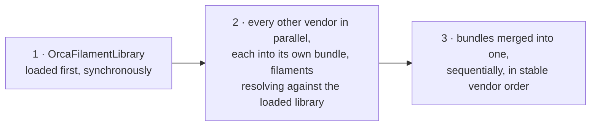
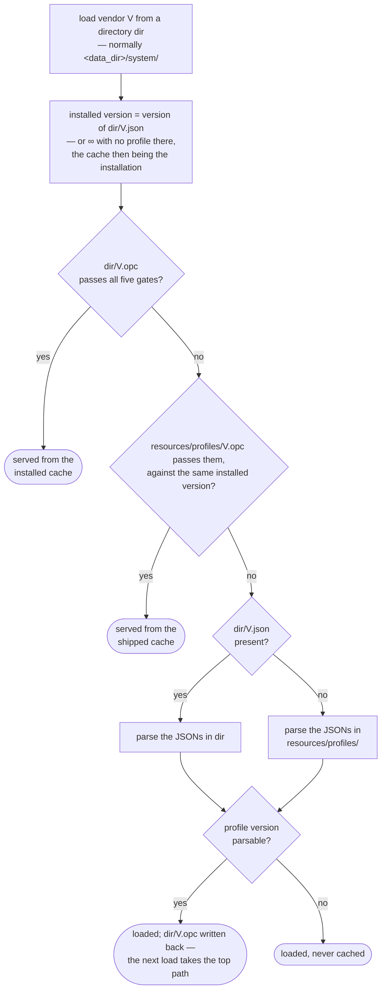

# System Preset Cache — High Level Design

## Why it exists

OrcaSlicer ships tens of thousands of system preset JSON files. Every launch used to
parse all of them: read each vendor profile, walk its machine, process and filament
sub-files, resolve inheritance, and build the preset collections from scratch. That
parse dominated startup, and it produced the same result every time, because system
presets only change when the app is updated or a profile update is installed.

The preset cache replaces that parse with a read. Each vendor's presets are serialized
once — at build time, in CI — into a single binary file the app reads in one pass. The
read replaces the file walk and the JSON parsing, which is where the time went;
resolving inheritance and registering the presets still runs at load, through the same
code the JSON path uses, so the result is the parse's result without the parse.

The cache is **only ever an optimization**. Every rule below exists to guarantee that a
cache is either provably equivalent to parsing the JSONs, or rejected. There is no
"mostly right" cache.

## The unit is one vendor

A cache covers exactly one vendor. `BBL.opc` sits beside `BBL.json` and holds
everything `BBL.json` and the `BBL/` sub-file tree would have produced.

Per-vendor granularity is what makes the system practical:

- A vendor whose profile is bumped invalidates only its own cache. The other 60-odd
  vendors keep theirs — even when the bumped vendor is the shared Orca filament
  library everyone else inherits from.
- The setup wizard, which loads vendors one at a time, gets the same speedup as
  startup without a second code path.
- A vendor with no cache, or a broken one, costs only that vendor a parse.

A cache holds *system* presets only. User presets, project settings and modified
presets are never serialized — they have their own storage and their own lifecycle.

## Where the files live

| Location | Contents on a shipped build | Role |
|---|---|---|
| `resources/profiles/` | `<vendor>.opc` alone — the profile and its preset JSONs both pruned | What the app ships with; the fallback everything falls back to |
| `<data_dir>/system/` | `<vendor>.opc` alone, or `<vendor>.json` + `<vendor>/` after an update | What the user has installed |
| `<data_dir>/system/` (dev build) | `<vendor>.json` + `<vendor>/` + `<vendor>.opc` written at runtime | A developer tree caches as it parses |

Two forms of the same vendor therefore exist, and the system's central rule is that
**a vendor's cache is the whole of it**. Where a cache ships or is installed, no profile
and no preset JSONs sit beside it: the cache carries the presets, the vendor profile,
and the version stamp that says which release it came from. A vendor is "installed" if
either form is present, and its installed version is read from whichever form is there.

What stays beside the caches in `resources/profiles/` is everything that is not a
preset: each vendor's directory of printer thumbnails, cover images, bed models and
hotend meshes, which are read from disk by path and were never part of the cache. Files
that are not vendors at all, `blacklist.json` chief among them, are untouched.

The alternative — shipping both and treating the cache as a sidecar — was rejected. It
doubles the installed size, and it creates a class of bug where the two disagree and
the app's behavior depends on which one a given code path happened to read.

## What a cache file is

A fixed-size header followed by one binary stream.

The header carries a magic number, the cache format version, the payload size and a
CRC32 of the payload. It exists so that a truncated download, a half-written file or a
file from an entirely different program is rejected in microseconds, before anything
tries to interpret it.

The payload opens with the stamps that decide whether the cache may be used at all —
format version, schema fingerprint, vendor name, vendor version — and then the
vendor's data: its vendor profile, three lists of preset entries (process, filament,
machine), and the count of errors the original parse hit.

Each entry is one preset **in source form**: what its JSON sub-file states and nothing
that resolving it derives — the preset's own config diff, the name of the preset it
inherits, and the parse metadata (name, sub-path, description, instantiation, setting
and filament ids, renames). Non-instantiated base presets are stored too; the children
that inherit from them cannot resolve without them.

Three deliberate choices in the layout:

- **Stamps come first**, so the question "what version is this vendor installed at?"
  can be answered by reading the first kilobyte. The updater asks that question for
  every vendor on every launch; reading tens of megabytes to answer it would give back
  the startup time the cache saved.
- **Nothing inherited is baked in.** A filament preset that inherits from the shared
  library is stored as its own diff plus its parent's name, and the parent is looked up
  when the entry is installed, against whatever library is loaded then. A cache
  therefore carries no other vendor's values, and no other vendor's update — the
  library's included — can make it stale.
- **Nothing derived is stored.** Default presets, flattened configs, aliases and
  lookup maps are all reconstructed at load by the same code the JSON path runs, and
  state that path never fills (obsolete-preset lists) is not stored either. This keeps
  the cache a record of the vendor's data, not a memory image of the program's state.

## When a cache may be used

A cache is accepted only if every gate below passes. Any failure means "parse the
JSONs instead" — never a hard error, never a partial load.

**1. Integrity.** Magic number, plausible size, CRC32 over the payload.

**2. Cache format version.** A single integer bumped by hand whenever the binary layout
changes in a way nothing else would catch: reordering or retyping a hand-written
serialized field, or changing what the cache's own stamps mean.

**3. Schema fingerprint.** A checksum over the app version and the entire print-config
option schema — every option's key, type, wire ordinal and enum values. This is the
gate that makes the cache safe across development: adding a config option, changing its
type, or reordering the enum values of an existing one all change the fingerprint, so
caches from before the change are rejected without anyone having to remember to bump
anything. It also means a cache never crosses app versions.

**4. Vendor identity and version.** The cache names the vendor it holds and the profile
version it was built from. It is accepted only if that version is at least as new as
the profile now on disk. Where no profile sits beside the cache — the shipped,
cache-only form — the comparison is skipped, because nothing on disk can be newer than
a cache that is the installation.

**5. Every entry installs.** Entries are installed as they are read, and an entry that
cannot be — typically one that inherits a parent the currently loaded filament library
no longer provides — rejects the whole cache, never just the entry. A partial vendor is
not a vendor.

There is deliberately no stamp for the shared filament library. A cache stores its
filaments' inheritance by name and resolves it at load, so a library update changes
what a cache load *produces*, never whether the cache is *valid* — the same file yields
the updated result. This matters most on a shipped build, where a vendor is its cache
and nothing else: a profile update that delivered only the library would otherwise have
stranded every other vendor with a cache it invalidated and no JSONs to fall back on.

A vendor profile with no parsable version is never cached and never served from a
cache. There would be no way to tell later whether the cache had gone stale, and a
cache nothing can invalidate is worse than no cache.

## How a vendor is loaded

Vendors load in a fixed order, because filament inheritance crosses exactly one
boundary: any vendor's filament may inherit from the shared Orca filament library,
and nothing else reaches across vendors. The library therefore goes first, alone;
every other vendor follows in parallel, resolving against it; and the results are
merged in a stable order:

Whether a vendor comes from its cache or from a parse changes nothing in that
order — both produce the same bundle, so cached and parsed vendors mix freely in
one startup. Each vendor load — startup's and the setup wizard's alike — tries,
in order:

1. The cache in the directory it was asked to load from — normally `<data_dir>/system/`.
2. The shipped cache in `resources/profiles/` — judged against the same installed
   profile, so it cannot resurrect a version an update has superseded.
3. Parsing the JSONs — from the data directory if the profile is installed there, and
   from `resources/profiles/` otherwise, which on a shipped build only has JSONs for a
   vendor that has no cache.

The same decision drawn out — "the gates" are the five acceptance checks above:

Serving from a cache is not a memory-image restore. The entries are deserialized and
then installed one by one — inheritance resolved against the presets installed before
them and the currently loaded filament library, configs flattened onto the collection
defaults, validated and registered — by the same function the JSON path calls straight
after parsing a sub-file. The two paths share everything below the parse, which is what
makes a cache-loaded bundle indistinguishable from a JSON-loaded one by construction
rather than by test coverage. Installation also rebuilds each preset's file path from
the local data directory, so a shipped cache never carries the generating machine's
paths.

The second tier is what makes app upgrades work. After an upgrade, a cache the previous
version installed fails the fingerprint gate; the new build's own shipped cache answers
instead, and the user never sees a parse. The stale installed file is simply ignored
until the next profile update overwrites it.

If a parse does happen and the vendor's profile carries a version, the app writes the
cache back beside where it looked for the vendor. That is how a developer build warms
itself up on second launch, and how a vendor delivered by a profile update becomes
cached without waiting for the next release.

## How a vendor is installed

Installing copies from `resources/profiles/` into `<data_dir>/system/`. A shipped build
offers only a cache and a source tree only JSONs, but a partially-generated tree can
have both, at different versions, so the installer picks the form that ships at the
**newer version** and installs only that one:

- Cache newer or equal, and readable → copy the `.opc`, and delete any profile and
  vendor directory a previous install left behind, so nothing can shadow it.
- Profile newer, or the cache unreadable or absent → copy the profile and the vendor's
  preset JSONs exactly as the app did before caches existed, and delete any stale `.opc`.

The result is that only one form of a vendor is ever present, and it is the newest one
the build has. This matters most for the update check, which compares what is installed
against what installing *would* lay down: if those two disagreed about which form
counts, a vendor could reinstall on every launch forever, or silently never update.

Profile updates delivered over the air always arrive as JSONs, and they win — an
updated vendor's real profile lands in the data directory, the shipped cache is older
and gets rejected, and the vendor is parsed and re-cached. An update that touches only
the filament library needs nothing more: every other vendor's cache stays valid and
simply resolves against the new library on its next load.

## How the caches are produced

Cache generation is a build step, not something a user ever runs.

One script per platform does the whole job, and CI calls it once on each. It builds a
small dev-utility that loads a profiles directory exactly as the app would, with cache
writing enabled, dropping a `<vendor>.opc` beside every vendor profile it parses; then
it copies those caches into each packaged application it was pointed at and deletes
every preset JSON they replace — the vendor's own profile included. Only a vendor that
actually has a cache is pruned, so a vendor the generator skipped keeps its JSONs and is
simply parsed at startup.

Because the schema fingerprint includes the app version, caches must be generated by
the same build that ships them. Generation runs after the build, in the same job.

## Behavior when things go wrong

The system is designed so that no cache problem is fatal:

- **Corrupt, truncated or foreign file** — rejected at the header, vendor parsed.
- **Cache from another app version or schema** — rejected at the fingerprint, vendor
  parsed or served from the shipped cache.
- **Stale cache** — rejected on the vendor version stamp, vendor parsed and re-cached.
- **Failure part-way through loading** — a deserialization error, or any entry that
  fails to install — rejects the whole cache, and the bundle is reset to a clean state
  before falling back, so a half-loaded cache can never leak into the parsed result.
- **A vendor that can be neither read nor parsed** — logged, and left out. The setup
  wizard drops that vendor from its list and opens with the rest; startup records the
  error alongside the vendors that did load. One broken vendor never takes the app down.

The one genuine limit: on a shipped build a vendor is its cache and nothing else, so a
rejected cache has nothing to fall back to for that vendor. This is by design — the
alternative is shipping every preset twice — and it is why the acceptance gates are
conservative and why CI generates the caches with the same build that ships them. The
recovery path is a profile update, which delivers real JSONs.

It also means nothing may quietly assume a `<vendor>.json` exists. Discovery, version
checks and the update decision all read whichever form is present, and a code path that
enumerates only `*.json` will find no vendors at all in a packaged build.

## Maintenance rules

- **Adding or changing a config option** needs nothing. The fingerprint covers it.
- **Changing a hand-written `serialize()`** — `PresetBundle::CachedPreset`,
  `VendorProfile` or its nested types — or the cache's own layout or stamps requires
  bumping the cache format version by hand. Nothing else is serialized by hand; the
  config payload is covered by the fingerprint.
- **Bumping a vendor profile's version** invalidates that vendor's cache and nothing
  else — the filament library's included. Other vendors' caches resolve against the
  new library the next time they load.
- **Caches are never committed.** They are build artifacts, generated per build,
  ignored by git.

## Where this lives in the tree

| Area | Files |
|---|---|
| Cache format, entry serialization, read/write, load and save | `src/libslic3r/PresetBundle.{hpp,cpp}` |
| Vendor profile serialization | `src/libslic3r/Preset.hpp` |
| Vendor discovery, installed/shipped versions, installation | `src/libslic3r/PresetBundle.cpp` |
| Update and reinstall decisions | `src/slic3r/Utils/PresetUpdater.cpp` |
| Setup wizard and printer-selection dialog | `src/slic3r/GUI/ConfigWizard.cpp`, `src/slic3r/GUI/WebGuideDialog.cpp` |
| Generator tool | `src/dev-utils/generate_system_cache.cpp` |
| Build and packaging script | `scripts/build_preset_cache.{sh,bat}` |
| Tests | `tests/libslic3r/test_vendor_cache.cpp` |
