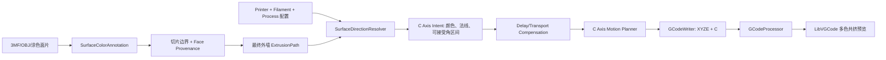

# OrcaSlicer 多色共挤与 C 轴控制开发规划

## 1. 项目目标

在 OrcaSlicer 2.4.2 基础上增加“单喷嘴、多色截面共挤耗材 + C 轴旋转定向”能力，使切片器能够：

1. 从模型或 `.3mf` 获取外表面的目标颜色。
2. 根据外表面法线和共挤耗材横截面色区，计算 C 轴目标角度。
3. 根据机械约束和熔体响应延迟生成连续、可执行的 C 轴运动。
4. 输出包含 XYZ/E/C 同步运动的 G-code。
5. 在 G-code 预览中显示由 C 轴旋转形成的多色挤出外观。

本文是工程实施规划。具体控制公式、参数命名和处理顺序应与目标设备协议、标定结果及相关专利权利要求保持一致。

## 2. 首版范围与非目标

### 2.1 首版建议范围

- FFF 工艺。
- 单喷嘴、单根多色共挤耗材。
- 有限个离散色区，每个色区由颜色 ID、基准角、有效角宽描述。
- 仅对可见外墙进行颜色定向；内墙、填充、支撑默认保持当前 C 角。
- 输入颜色先支持三角面/涂色面片的离散颜色，后续再支持纹理和顶点颜色插值。
- C 轴使用绝对连续角输出，默认轴字母为 `C`，但由打印机配置决定。
- C 轴受最大角速度、角加速度和机械角度范围约束。
- 受控外墙优先输出 `G1` 微线段；首版不在 C 角变化段使用 `G2/G3`。

### 2.2 首版明确不做

- 不同时支持 MMU 换料和共挤 C 轴；首版将两者设为互斥能力。
- 不对稀疏填充、支撑内部路径做精确表面配色。
- 不承诺从任意纹理 3MF 直接得到连续真彩色结果。
- 不重写整个运动规划器；先在 Orca 现有路径和速度规划上增加旋转轴约束。
- 不以全局射线扫描重新构造“外表面网格”；优先复用切片后的真实边界及其来源信息。

## 3. 对原始方案的关键优化

### 3.1 不使用“全局变量定义字典”

所有参数进入 Orca 的类型化配置体系：

- 打印机机械参数进入 printer preset。
- 耗材截面和熔体响应参数进入 filament preset。
- 分段精度和顶底面策略进入 print preset。
- 模型颜色到耗材色区的映射进入 project config/`.3mf`。

这样可以自然获得预设继承、工程保存、CLI 使用、兼容迁移和切片失效能力。

### 3.2 共挤颜色注释与 MMU 涂色分离

现有 `ModelVolume::mmu_segmentation_facets` 的含义是将涂色面分配给不同耗材/挤出机，后续会参与 `MultiMaterialSegmentation`。共挤功能需要的是“同一挤出机下，外表面希望显示哪个截面色区”。两者语义不同。

规划新增独立的表面颜色注释，例如：

```text
SurfaceColorAnnotation
  face_id -> SurfaceColorId
```

不能直接复用或改写 `mmu_segmentation_facets`，否则会破坏普通多材料切片。

### 3.3 不单独提取一份外表面网格

射线求交能够辅助判断可见性，但直接在原始模型上提取外壳会遇到负体积、修改体、多 Volume 布尔、非流形修复和装配体遮挡等问题。

推荐方案：

1. 切片时保留“切片边界线段来自哪个 Volume/三角面”的 provenance。
2. C 轴只作用于最终被分类为外墙的 `ExtrusionPath`。
3. 最终外墙段通过 provenance 或空间查询获得三角面法线和颜色。

射线/AABB 最近面查询保留为原型期或 provenance 丢失时的回退手段，而不是主数据源。

### 3.4 将角度规划和动态补偿分成两层

```text
几何层：表面颜色 + 法线 -> 可接受的 C 角区间
运动层：C 角区间 + 路径速度 + 机械限制 + 响应延迟 -> 实际 C 轴指令
```

几何层不依赖打印速度，便于测试和缓存；运动层在路径顺序、速度和挤出量基本确定后执行。

### 3.5 使用“有效角区间”，不只使用色区中心角

若一个颜色区域有效角宽为 `w`，能显示该颜色的 C 轴位置不是单点，而是一个角度区间。规划器应选择距离历史 C 角最近且满足可见性的角度，而不是始终转到色区中心。

这会显著减少 C 轴抖动、反转和无效大跨度运动。

## 4. 目标系统架构



建议在 `src/libslic3r/CoExtrusion/` 下建立独立模块，避免继续扩大 `Print.cpp`、`PrintObject.cpp` 和 `GCode.cpp`。

建议文件：

```text
src/libslic3r/CoExtrusion/
├─ CoExtrusionTypes.hpp
├─ SurfaceColorAnnotation.hpp/.cpp
├─ SurfaceDirectionResolver.hpp/.cpp
├─ CAxisAngleSolver.hpp/.cpp
├─ CAxisMotionPlanner.hpp/.cpp
├─ DelayCompensator.hpp/.cpp
└─ CoExtrusionGCodeMetadata.hpp/.cpp
```

这些文件加入 `src/libslic3r/CMakeLists.txt`。

## 5. 数据模型设计

### 5.1 色区定义

```cpp
struct CoExtrusionColorSector {
    SurfaceColorId color_id;
    float center_angle_deg;
    float angular_width_deg;
    ColorRGBA preview_color;
};

struct CoExtrusionProfile {
    std::vector<CoExtrusionColorSector> sectors;
    float calibration_offset_deg;
};
```

约束：

- `center_angle_deg` 归一化到 `[0, 360)`。
- `angular_width_deg` 大于 0 且不超过 360。
- 色区可允许存在小范围重叠，但必须定义冲突优先级。
- 颜色 ID 是稳定逻辑 ID，不能直接使用 UI 列表索引。
- Preview 使用的 RGBA 只负责显示，算法映射使用 `SurfaceColorId`。

### 5.2 表面颜色注释

建议给 `ModelVolume` 增加独立的 `SurfaceColorAnnotation`，保留面片级颜色 ID，并像其他 Facet annotation 一样拥有时间戳和复制语义。

```text
ModelVolume
├─ mmu_segmentation_facets      # 现有：多挤出机/MMU
└─ coextrusion_surface_colors   # 新增：同一耗材截面颜色需求
```

需要同步处理：

- Model 复制、移动、备份和 mesh repair 后的面索引 remap。
- `Print::apply()` 对 annotation timestamp 的比较。
- `.3mf` 导入导出。
- Undo/Redo cereal 序列化。
- GUI 面片涂色或导入颜色转换。

### 5.3 路径控制意图

不要一开始把 C 轴角直接塞进普通 `Point`。建议使用独立结构：

```cpp
struct CAxisIntentSample {
    Vec3d position_mm;
    SurfaceColorId color_id;
    Vec3f surface_normal;
    float preferred_angle_deg;
    AngularInterval valid_angle;
    bool orientation_defined;
};
```

最终运动规划输出：

```cpp
struct CAxisMove {
    Vec3d end_position_mm;
    double extrusion_delta_mm;
    double c_angle_deg;       // 连续展开后的绝对角
    double feedrate_mm_s;
    CAxisMoveMode mode;       // 同步挤出、预定位、独立旋转
};
```

### 5.4 Provenance 数据

当前 `TriangleMeshSlicer` 的 `IntersectionLine` 保存源顶点和源边，但没有长期保留源 `face_id`，而多边形 union/offset 后还会丢失对应关系。

生产方案建议增加旁路数据：

```cpp
struct SliceBoundarySource {
    ObjectID volume_id;
    uint32_t face_id;
    Line boundary_segment;
    Vec3f transformed_normal;
    SurfaceColorId color_id;
};
```

每层建立空间索引，最终外墙段按最近、方向一致、距离容差查询来源。不要在 `Polygon` 的每个点上长期绑定裸三角面指针。

## 6. 配置项规划

以下是建议命名，实施前需按 Orca 现有命名风格最终确认。

### 6.1 Printer preset

| 配置键 | 含义 |
| --- | --- |
| `coextrusion_c_axis_enabled` | 打印机是否支持共挤 C 轴 |
| `coextrusion_c_axis_letter` | 轴字母，默认 `C` |
| `coextrusion_c_axis_direction` | 正向符号，`1` 或 `-1` |
| `coextrusion_c_axis_zero_offset` | 机械零位偏移 |
| `coextrusion_c_axis_rotation_mode` | 最短双向、仅正向、有限角度 |
| `coextrusion_c_axis_min/max` | 有限角度模式的软限位 |
| `coextrusion_c_axis_max_speed` | 最大角速度，deg/s |
| `coextrusion_c_axis_max_acceleration` | 最大角加速度，deg/s² |
| `coextrusion_c_axis_max_jerk` | 可选角速度突变量 |
| `coextrusion_c_axis_start_gcode` | 归零/使能/模式初始化 |
| `coextrusion_c_axis_end_gcode` | 复位或释放 |

### 6.2 Filament preset

| 配置键 | 含义 |
| --- | --- |
| `coextrusion_sector_color_ids` | 色区逻辑 ID 数组 |
| `coextrusion_sector_colors` | Preview RGBA 数组 |
| `coextrusion_sector_center_angles` | 色区基准角数组 |
| `coextrusion_sector_angular_widths` | 有效角宽数组 |
| `coextrusion_calibration_offset` | 装配/装料补偿角 |
| `coextrusion_response_delay_time` | 时间模型响应延迟 |
| `coextrusion_transport_volume` | 体积输运模型的等效滞后体积 |
| `coextrusion_delay_model` | 禁用、固定时间、输运体积、标定曲线 |

### 6.3 Print preset

| 配置键 | 含义 |
| --- | --- |
| `coextrusion_surface_control` | 禁用/仅外墙/指定墙层 |
| `coextrusion_max_segment_length` | C 轴控制微段最大长度 |
| `coextrusion_angle_tolerance` | 合并相邻控制段的角度容差 |
| `coextrusion_angular_safety_margin` | 色区两侧的角度安全余量，至少应等于角度容差 |
| `coextrusion_normal_xy_threshold` | XY 投影法线安全阈值 |
| `coextrusion_top_bottom_strategy` | 保持、主色、切向、固定角 |
| `coextrusion_large_rotation_strategy` | 降速、预定位、独立旋转 |
| `coextrusion_preview_quality` | 关闭、主色段、真实截面 |

### 6.4 Project config

保存：

- 模型颜色/材质标识到 `SurfaceColorId` 的映射。
- 未映射颜色的回退色区。
- 项目是否启用共挤映射。

配置增加后，需要更新 `PrintConfigDef`、静态配置类型、UI、profile、`Print::apply()` 失效映射和 legacy 默认行为。

## 7. 几何与角度解算

### 7.1 坐标约定

必须在代码注释和设备协议中固定：

- 世界 XY 平面：X 正方向为 0°，逆时针为正。
- 三角面法线必须变换到打印坐标系，并包含 object/volume/instance 变换。
- C 轴正方向由 `coextrusion_c_axis_direction` 转换。
- `calibration_offset` 与机械 `zero_offset` 分开，避免重复补偿。
- 内部计算使用连续角，输出阶段按固件要求转换。

### 7.2 法线投影

对外墙采样点的单位法线 `n = (nx, ny, nz)`：

```text
r = sqrt(nx² + ny²)
phi = atan2(ny, nx)
```

当 `r >= normal_xy_threshold` 时，`phi` 为表面法线方位角。

当 `r < normal_xy_threshold` 时，顶/底面的径向颜色定向不唯一，进入顶底面策略，不应继续使用噪声放大的 `atan2` 结果。

### 7.3 原始目标角

设目标色区基准角为 `beta`，机械零位为 `zeta`，耗材标定角为 `delta`，轴方向符号为 `s`：

```text
C_raw = s * (phi - beta - zeta - delta)
```

实际正负号需要通过设备正向旋转试验确认，并固化成单元测试。

色区有有效角宽时，将 `C_raw` 扩展为可接受角区间，而不是单一角值。

### 7.4 多周期展开

候选值为：

```text
Ck = C_raw + 360° * k
```

规划器根据旋转模式选择候选：

- 最短双向：最小化 `abs(Ck - C_prev)`。
- 仅正向：选择满足 `Ck >= C_prev` 的最小差值。
- 有限角度：仅保留软限位内候选，再最小化运动代价。

当存在有效角区间时，先把历史角投影到每个等效可行区间，再计算代价。代价函数建议同时考虑：

```text
角位移 + 方向反转惩罚 + 接近软限位惩罚 + 未来不可达惩罚
```

首版可使用贪心选择，后续可对一个闭环/一层采用动态规划减少整体旋转量。

### 7.5 顶底面策略

建议支持：

- `hold_last`：保持最近有效 C 角，最稳定。
- `primary_color`：转到主色区固定角。
- `tangent_follow`：使用路径切向的法向方向，视觉连续但不代表真实面法线。
- `disable_control`：该段不输出新 C 值。

首版默认 `hold_last`。顶底实体填充不在“仅外墙”模式内控制。

## 8. 外墙分段与来源追踪

### 8.1 原型路径

为尽快验证机械效果，可在 `GCode::extrude_path()` 附近对最终外墙采样点执行 AABB 最近三角面查询：

1. 将打印路径点转换回对应对象/Volume 坐标或把网格预变换到打印坐标。
2. 搜索最近外表面三角形。
3. 检查距离、法线方向和所属颜色。
4. 无可靠匹配时保持上一角度并记录 warning。

该方案实现快，但复杂模型性能和薄壁歧义较大，只作为可行性原型。

### 8.2 生产路径

在 `TriangleMeshSlicer` 生成切片交线时记录 `face_id`，建立每层 `SliceBoundarySource`。经过布尔运算后，为最终 slice contour 和外墙中心线重新关联来源。

关联评分至少包含：

- 距离。
- 线段方向相似度。
- 外墙点沿法线偏移后的距离。
- Volume/region 一致性。
- 颜色边界不可跨越约束。

### 8.3 微段分割

外墙在以下位置切分：

- 目标颜色 ID 变化。
- 有效角区间不连续。
- C 角变化超过容差。
- 段长度超过最大控制长度。
- 路径尖角、接缝、回抽或非挤出移动边界。

元数据必须能随 `reverse()`、`clip_end()`、simplify 和 seam 调整保持一致。若把采样直接挂到 `ExtrusionPath`，必须同步修改所有复制、移动、反转、裁剪和简化代码。更稳妥的首版是在最终路径顺序确定后生成 `CAxisIntent`。

## 9. 动态延迟补偿

### 9.1 两种模型

固定时间模型：

```text
lead_distance = path_speed * response_delay_time
```

输运体积模型：

```text
lead_extrusion_length = transport_volume / filament_cross_section
```

固定时间模型简单，但速度变化会改变补偿距离；输运体积模型通常对挤出系统更稳定。建议同时保留，通过标定决定默认模型。

### 9.2 上游事件回溯

不要只在当前微段内把触发点向前平移。应把有序挤出路径视为累计坐标轴：

```text
当前颜色事件
  -> 按累计时间、路径长度或挤出体积向上游回溯
  -> 可能跨越多个微段
  -> 遇到 travel/retract/toolchange/seam 时按策略处理
  -> 在目标段内部插入新的分割点
```

需要保存打印开始时的初始颜色/C 角，否则首个延迟窗口内的颜色不可定义。

### 9.3 与速度规划的顺序

若使用时间延迟，补偿必须基于最终或接近最终的速度。Orca 的冷却和后处理可能继续改变 `F`，因此建议两级实现：

- MVP：使用输运体积或路径长度补偿，在 `GCode::extrude_path()` 前生成事件。
- 生产版：在最终速度过滤后执行结构化第二遍 C 轴事件对齐，必要时拆分 G1。

不要在已输出纯文本后丢失表面颜色/法线语义；若必须文本后处理，应先写内部控制标记，并在最终文件中移除。

## 10. C 轴运动规划

### 10.1 同步运动约束

对长度 `L`、线速度 `v`、角位移 `deltaC` 的挤出段：

```text
T_xyz = L / v
omega_required = abs(deltaC) / T_xyz
```

若 `omega_required` 超过最大角速度，则：

1. 优先在有效色区角度区间内选择更近的 C 角。
2. 尝试在上一个 travel 或接缝处预定位。
3. 下调该段 XYZ 进给速度。
4. 仍不可行时才执行独立旋转策略。

C 轴角加速度同样必须满足限制。不能把角度直接加入 XYZ 的欧氏路径长度；它是独立单位的同步约束轴。

### 10.2 大角度跳变

大角度跳变处理优先级：

```text
连续角展开
  -> 利用有效角宽减少运动
  -> 在前一非挤出移动中预转
  -> 降速同步旋转
  -> 回抽 + 独立旋转 + 恢复挤出
```

独立旋转会产生停顿和表面缺陷，应作为最后回退，而不是所有颜色边界的默认行为。

### 10.3 闭环与接缝

- 闭环起点影响整圈 C 轴运动量，可把接缝选择与 C 轴代价联合评估。
- 路径反转会改变事件顺序，但表面法线目标本身不应被简单取负。
- spiral vase 需要连续跨层规划，不能每层重置角度。
- by-object 和 by-layer 的历史 C 状态范围不同。

## 11. G-code 生成

### 11.1 固件契约优先

正式编码前必须确认：

- `G90/G91` 是否同时影响 C 轴。
- C 轴单位是否为度。
- 是否允许 `G1 X.. Y.. E.. C.. F..` 同步插补。
- C 轴能否超过 360°，还是必须归一化。
- 归零、使能、禁用、软限位和急停指令。
- C 轴运动是否参与固件的速度/加速度规划。
- 断电续打、暂停恢复和 `G92` 对 C 轴的要求。

这些内容形成单独的 firmware contract 测试样例。

### 11.2 Writer 修改

建议给 `GCodeWriter` 增加明确接口，而不是在字符串末尾随意拼接：

```cpp
std::string extrude_to_xyc(
    const Vec2d& point,
    double dE,
    double c_angle_deg,
    const std::string& comment);

std::string rotate_c_axis(
    double c_angle_deg,
    double angular_feedrate_deg_s);
```

`GCodeWriter` 保存当前 C 角状态，避免重复输出，并在 preamble/postamble 调用打印机模板。

### 11.3 Arc 策略

对 C 轴受控且角度变化的外墙，首版强制线性化为 G1。原因是不同固件对 `G2/G3 + C` 的同步语义不一致，且 Preview 也需要插值 C 角。

不受控路径仍可沿用现有 arc fitting，避免全局文件体积回退。

### 11.4 G-code 元数据

在文件头写入可选注释，用于外部 G-code 重新打开时恢复 Preview：

```text
; coextrusion_enabled = 1
; coextrusion_axis = C
; coextrusion_profile = <版本化、转义后的色区描述>
; coextrusion_angle_mode = continuous_absolute
```

元数据必须有版本号和大小限制，解析失败时降级成普通单色预览。

## 12. G-code 解析、时间估算与预览

### 12.1 GCodeProcessor

现有 `AxisCoords` 和时间估算主要按 XYZE 四轴处理。不要直接把 C 当作毫米线性轴加入距离计算。

建议增加独立状态：

```cpp
struct RotaryAxisState {
    double start_angle_deg;
    double end_angle_deg;
    double angular_speed_deg_s;
};
```

修改点：

- `GCodeReader::GCodeLine` 能读取可配置 C 轴字母。
- `process_G1()` 单独解析 C 值。
- `MoveVertex` 增加 `c_axis_angle` 和必要的有效标志。
- 时间估算以 XYZ/E 预计时长和 C 轴最小时长的最大值为约束。
- 独立 C 旋转生成 rotary move，不能伪装成 XYZ travel。
- `G92`、相对/绝对模式、暂停恢复同步维护 C 状态。

### 12.2 Preview 数据桥

数据路径：

```text
GCodeProcessorResult::MoveVertex
  -> GUI/LibVGCode/LibVGCodeWrapper
  -> libvgcode::PathVertex
  -> Viewer buffer/shader
```

需要给两侧顶点数据增加 C 角和共挤 profile ID。修改聚合初始化器时应改为具名赋值或构造函数，避免字段增加导致错位。

### 12.3 两级预览

MVP 预览：

- 每个挤出段根据 C 角显示当前朝外的主色。
- 用于验证解析、角度连续性和颜色边界位置。

高精度预览：

- 生成管状/扁平挤出网格时保留截面周向坐标。
- 将共挤色区转为 360° 的一维颜色 LUT 纹理。
- Shader 使用“周向角 - 插值后的 C 角”采样 LUT。
- 段首/段尾 C 不同时自然显示扭转/螺旋色带。
- 对顶底盖和宽扁挤出截面定义单独 UV/周向规则。

一维 LUT 比在 shader 中传可变长度色区数组更简单，也更适合不同色区数量。

## 13. UI 规划

### 13.1 打印机设置

增加“C 轴/多色共挤能力”页面：

- 支持开关、轴字母和方向。
- 机械零位、软限位、最大角速度/加速度。
- 初始化与结束 G-code。
- “转到 0°/90°/180°/270°”设备标定辅助入口。

### 13.2 耗材设置

增加共挤截面编辑器：

- 极坐标圆盘显示色区。
- 每个色区可编辑颜色、中心角和有效角宽。
- 显示重叠、空白和非法角宽警告。
- 编辑标定补偿角和延迟模型参数。
- 支持保存到 filament preset。

### 13.3 工程颜色映射

增加模型颜色到色区的映射面板：

- 左侧列出模型中检测到的颜色/材质 ID。
- 右侧选择 `SurfaceColorId`。
- 标记未映射颜色。
- 提供最近 RGB 自动匹配，但必须允许人工覆盖。
- 映射保存到 project config 和 `.3mf`。

### 13.4 Preview

- 增加普通耗材色、C 轴目标角、共挤真实颜色三种显示模式。
- 图例显示 C 角范围、无定义法线段、超限降速段和独立旋转点。
- 点击路径时显示 XYZ、E、C、目标颜色、法线方位角和补偿前后触发位置。

## 14. 分阶段实施计划

### 阶段 0：设备协议与算法原型

目标：在深改 Orca 前验证 C 轴机械和颜色朝向关系。

工作：

- 固化坐标、正方向、绝对/相对模式和 G-code 契约。
- 用独立小程序或单元测试验证角度公式、多周期展开和有效角区间选择。
- 用手写 G-code 验证同步 `XYEC`、最大角速度和独立旋转。
- 打印标定件测量 `calibration_offset` 和延迟参数。

退出条件：已知 C 正方向、零位、可持续角速度、加速度和至少一种可用延迟模型。

### 阶段 1：配置、数据模型与 UI 骨架

工作：

- 增加 printer/filament/print/project 配置。
- 新增 `SurfaceColorAnnotation` 和共挤类型。
- 完成打印机与耗材设置 UI。
- 选项关闭时不改变任何现有行为。

退出条件：参数可创建、保存、重开并进入 `DynamicPrintConfig`。

### 阶段 2：颜色导入与 3MF 持久化

工作：

- 从 3MF base material/triangle property 或 Orca 扩展读取离散面颜色。
- OBJ 面色/顶点色先量化为离散 `SurfaceColorId`。
- 实现工程颜色映射 UI。
- 在 `bbs_3mf` 保存独立共挤面片数据和映射。

退出条件：保存并重开工程后，面片颜色 ID、色区配置和映射不变；旧工程正常打开。

### 阶段 3：法线解析与外墙 C 意图

工作：

- 先以 AABB 最近三角面查询完成 MVP。
- 只处理 external perimeter。
- 实现法线投影、顶底面策略、有效角区间和连续角展开。
- 将角度意图以 debug dump 或 Preview 简化颜色显示出来。

退出条件：圆柱、方块、斜面和带离散颜色边界的模型能生成稳定连续的目标角序列。

### 阶段 4：C 轴 G-code MVP

工作：

- 增加 `GCodeWriter` C 轴接口和状态。
- 受控外墙禁用 arc fitting，按角度/长度切分 G1。
- 输出连续绝对 C 角。
- 实现最大角速度约束和简单降速。
- 首版暂不启用动态延迟或使用固定路径长度补偿。

退出条件：设备可执行输出文件，无 C 轴超速，普通切片在开关关闭时不变。

### 阶段 5：Provenance 与生产级分段

工作：

- 在 `TriangleMeshSlicer` 保留 face provenance。
- 建立每层来源空间索引。
- 用 provenance 替代 AABB 全模型最近面查询。
- 正确处理颜色边界、布尔后的外壳、薄壁和多 Volume。

退出条件：复杂模型的法线/颜色归属稳定，性能满足可接受范围。

### 阶段 6：动态延迟和完整运动学

工作：

- 建立跨微段的累计时间/体积事件轴。
- 实现固定时间、输运体积和标定曲线模型。
- 处理 travel、retract、seam、暂停和打印起始状态。
- 增加角加速度、反向惩罚、预定位和独立旋转回退。
- 必要时增加最终速度后的第二遍控制事件对齐。

退出条件：不同打印速度下颜色边界偏差保持在验收阈值内，且无机械约束违规。

### 阶段 7：解析与高精度 Preview

工作：

- `GCodeProcessor` 解析 C 和 profile metadata。
- `MoveVertex`/`PathVertex` 传递 C 角。
- 先实现段主色 Preview。
- 再实现截面 LUT + shader 的真实扭转色带。
- 支持重新打开外部 G-code。

退出条件：Preview 的颜色边界、旋转方向和实际 G-code 一致。

### 阶段 8：兼容、性能与产品化

工作：

- CLI、单盘/多盘、by-layer/by-object、spiral vase 行为。
- 内存、切片耗时、G-code 文件体积和 Preview FPS 优化。
- Profile 迁移、错误提示、参数校验和文档。
- 根据验证结果决定是否支持 MMU + 共挤组合、纹理颜色和更多路径类型。

## 15. 主要代码修改地图

| 模块 | 主要文件 | 修改内容 |
| --- | --- | --- |
| 配置定义 | `PrintConfig.cpp/.hpp` | C 轴、色区、延迟、Preview 参数 |
| Preset/UI | `GUI/Tab.*`, `ParamsPanel.*`, 新截面控件 | 参数编辑和校验 |
| 模型 | `Model.hpp/.cpp`, `PrintApply.cpp` | 独立表面颜色 annotation、复制和失效 |
| 3MF | `Format/3mf.*`, `Format/bbs_3mf.*` | 颜色导入、项目字段、版本兼容 |
| 切片来源 | `TriangleMeshSlicer.*`, `PrintObjectSlice.cpp` | face provenance |
| 外墙 | `PerimeterGenerator.*`, `Arachne/`, `ExtrusionEntity.*` | 外墙标识和必要的微段数据 |
| 角度/补偿 | 新 `CoExtrusion/` | 纯算法模块 |
| G-code | `GCode.cpp/.hpp`, `GCodeWriter.*` | C 轴意图、同步输出、独立旋转 |
| Parser | `GCode/GCodeProcessor.*`, GCodeReader | C 轴状态和时间估算 |
| Preview bridge | `GUI/LibVGCode/LibVGCodeWrapper.*` | MoveVertex 到 PathVertex |
| Viewer | `src/libvgcode/` | C 数据、LUT、mesh/shader |
| 构建 | 两个模块的 `CMakeLists.txt` | 新文件接入 |

## 16. 测试与标定矩阵

### 16.1 纯算法测试

- `atan2` 四象限与坐标方向。
- `normal_xy_threshold` 上下边界。
- 0/360° 跨越。
- 最短双向、仅正向、有限角度三种展开。
- 有效角区间重叠、空白和软限位裁剪。
- 路径反转和闭环起点变化。
- 延迟事件跨一个/多个微段、跨 seam 和 retract。
- 角速度/角加速度超限时的降速与回退。

### 16.2 几何模型

| 模型 | 验证目标 |
| --- | --- |
| 圆柱 | C 角应随方位平滑变化 |
| 方柱 | 四个面为稳定角，拐角受限 |
| 圆锥/斜面 | 法线 XY 投影和连续性 |
| 平顶方块 | 顶底面策略 |
| 薄壁壳 | 最近面歧义和 provenance |
| 多 Volume 布尔模型 | 最终外壳来源正确 |
| 两色竖直边界 | 延迟补偿误差 |
| 螺旋花瓶 | 跨层连续角 |
| 多盘同模型 | 每盘状态隔离 |

### 16.3 G-code/Preview 测试

- C 开关关闭时不出现 C 指令。
- 连续绝对角不产生无故 360° 跳变。
- 每段所需角速度、角加速度不超限。
- 受控段不生成不兼容的 G2/G3。
- GCodeProcessor 重新读取后 C 角一致。
- Preview 主色与高精度模式旋转方向一致。
- 无共挤 metadata 的旧 G-code 正常打开。

### 16.4 实机标定

- 机械零位和正方向标定件。
- 不同速度下的颜色边界阶跃件。
- 不同流量/层高/线宽下的输运延迟件。
- 反向旋转、连续多圈和长时间漂移测试。
- 急停、暂停恢复、断电续打和回零安全性。

## 17. 验收指标

建议在设备能力确认后填写具体阈值：

- 颜色边界平均位置误差 `<= X mm`，最大误差 `<= Y mm`。
- C 轴目标角误差 `<= A°`。
- 无超过配置最大角速度/角加速度的指令。
- 开关关闭时默认配置和普通 G-code 行为不变。
- 旧 `.3mf`、旧 profile、无 C 轴 G-code 可正常加载。
- 同一 G-code 在 Parser 与 Preview 中的 C 角序列一致。
- 典型模型切片时间增量和内存增量不超过约定比例。
- 高精度 Preview 在目标硬件达到约定 FPS。

## 18. 风险与缓解

| 风险 | 影响 | 缓解方案 |
| --- | --- | --- |
| 切片布尔后丢失三角面来源 | 法线或颜色关联错误 | provenance side-channel + 空间索引 |
| 最近三角面歧义 | 薄壁/尖角角度跳变 | 距离、方向、Volume 联合评分 |
| C 与固件插补语义不一致 | 实机不可执行 | 阶段 0 先固化 firmware contract |
| 速度后处理改变延迟距离 | 色边界错位 | 输运体积模型或最终速度后第二遍对齐 |
| 路径简化/反转丢元数据 | C 序列错乱 | 最终路径后生成 intent，或完整维护 metadata 变换 |
| C 轴大角度反转 | 停顿和表面瑕疵 | 有效角区间、连续展开、预定位、降速 |
| G2/G3 与 C 同步不统一 | 轨迹/预览不一致 | 受控段首版强制 G1 |
| 与 MMU 逻辑混淆 | 普通多色功能回归 | 独立 annotation 和首版互斥校验 |
| Preview 顶点数据膨胀 | 显存和 FPS 下降 | LUT、按功能启用额外 attribute、质量等级 |
| 3MF 扩展不兼容 | 工程打不开 | 可选、版本化字段和缺失回退 |

## 19. 推荐首个可交付闭环

不要一开始同时实现完整 UI、动态补偿和高精度 shader。最短可验证闭环为：

```text
硬编码/测试 profile
  -> 两色圆柱面片颜色
  -> AABB 最近面法线
  -> 有效角区间 + 连续展开
  -> 外墙 G1 中写入 C
  -> GCodeProcessor 解析 C
  -> Preview 按段显示朝外主色
  -> 实机圆柱与颜色边界标定
```

该闭环验证四个最大不确定项：设备旋转方向、法线到 C 角公式、固件同步插补、颜色响应延迟。验证通过后再投入 provenance、完整 Preset/UI 和真实截面 shader，可显著降低返工风险。
