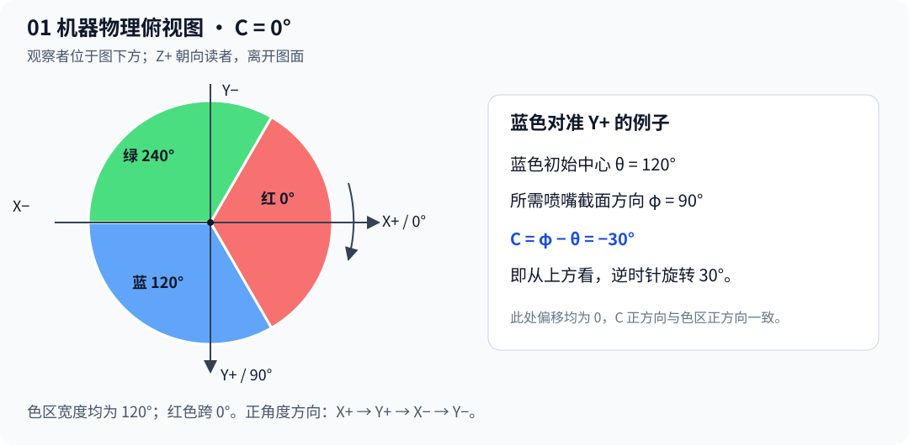
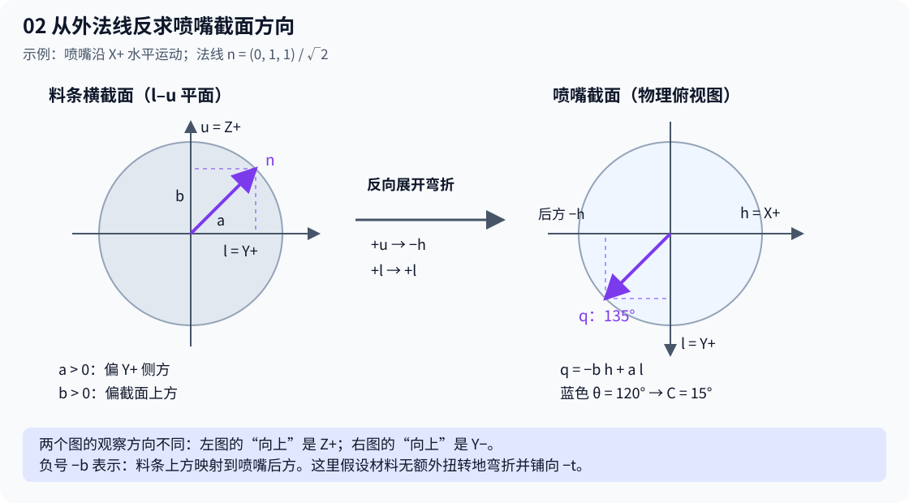
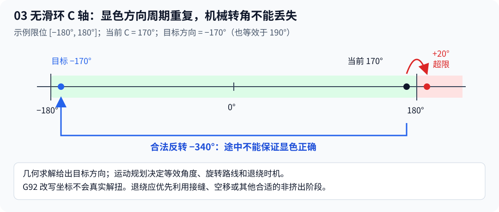

# 多色共挤 C 轴算法与几何意义

本文记录本项目当前的三维方向求解算法，并区分已经实现的功能和后续运动规划工作。配图采用 SVG，可随文档一起复制、缩放和打印。

**颜色计算方法选项（2026-09-07）：** 在“工艺 → 质量 → 多色共挤”中，通过“颜色计算方法”下拉框选择：

- **二维 - XY 平面法向量**（`coextrusion_color_method = normal_xy`）：方向角 `φ = atan2(ny, nx)`，不使用运动向量、法向量 Z 分量或椭圆修正。C 中心角仍为 `axis_direction × (φ − 颜色扇区中心角 − 耗材标定偏移 − C 零位偏移)`。XY 投影为零或低于阈值时保持上一 C 角度，不为纯顶底面指定任意方向。
- **三维 - 椭圆模型**（`coextrusion_color_method = ellipse_3d`，默认）：保留当前算法。在默认 `tangent_follow` 顶底面策略下使用下文的三维沉积和椭圆修正；旧项目显式设置的其他顶底面策略继续生效。

选项随工艺预设和 3MF 项目保存；旧文件缺少该字段时取默认三维，不改变原有算法。切换选项会使 G-code 导出失效并重新计算 C 角度，角度限位、同步运动和退绕继续由现有规划器处理。G-code 文件头记录全局选择，物体级覆盖以实际路径配置为准。

手动验证（本次未执行）：同一涂色模型分别选择二维和三维重新切片，检查导出配置为 `normal_xy` / `ellipse_3d`；二维在相同 XY 法向方位、颜色和标定下应有相同的目标中心角（最终命令仍允许区间及限位规划调整），三维倾斜曲面应继续产生椭圆修正。确认二维纯顶底面保持上一角度，保存重开项目后选项保留，旧项目默认三维。

当前实现说明基于 2026-09-05 的源码阅读，没有编译、运行测试或进行实物验证。本文描述的是理想沉积模型，不能将软件预览当作实际显色验证。

**椭圆修正更新：** 普通水平挤出路径在 `tangent_follow` 模式下，现在使用路径自身的线宽 W 和层高 H，按“圆截面随材料一起仿射压扁为椭圆”的假设修正显色角度。以下正文中的圆条公式仍作为基础模型；启用上述路径的实际公式改为 `q = (n·l)l − (W/H)(n·b)u`。其中 u 是 XY 运动方向，l 是横向，b 是垂直于三维运动方向的上方截面方向。

修正目标是无遮挡、正交观察下的目标颜色可见投影面积，而不是椭圆上单个点的表面法线。实现使用等价的 `q = H(n·l)l − W(n·b)u` 并除以 `max(W,H)`，避免直接计算大宽高比。退化法线阈值仍使用未加权的径向分量长度，防止压扁权重导致角度控制意外启停。

W/H 为 1 或尺寸缺失、非正、非有限时保留圆形模型。桥接、斜接缝及非平面路径暂时沿用圆形模型，因为当前这些路径尚未提供可靠的局部沉积截面厚度；运动的 Z 增量不等于该厚度。三维模式下其他顶底面策略保持原行为。几何修正发生在延迟补偿之前，C 轴限位及退绕规划保持原逻辑。

验证参考（本次未编译、未运行测试）：沿 X+ 打印、法线为 `(0,1,1)` 时，W=0.45 mm、H=0.20 mm 应得到约 156.04° 的表面方位；蓝色中心为 120°、方向为正且偏移为零时，目标区间中心约为 36.04°。圆形对照为 135°／15°。纯侧面、纯顶面方位应保持不变；重新切片时还应确认桥接及关闭表面控制的项目不受修正影响。

## 1. 算法解决什么问题

多色共挤耗材的不同颜色占据截面的不同区域。旋转打印头会改变这些区域的朝向。算法需要根据模型外法线、打印运动方向和目标颜色，计算打印头应处于哪个 C 轴角度。

处理分为两层：

1. **几何求解：** 当前表面需要哪一个颜色朝向？输出目标中心角及允许角度区间。
2. **运动规划：** 怎样在有限累计转角、速度和加速度约束下到达目标？输出实际 C 轴坐标和运动方式。

几何正确不意味着执行过程必然正确。目标角度合法，也不意味着到达目标途中可以持续挤出。

## 2. 机器坐标与颜色约定

从机器 Y 正方向观察：X 向右为正，Y 向观察者为正，Z 向上为正。对应的物理俯视图中，X+ 向右，Y+ 向下。

- X+ 为颜色截面和 C 轴的 0° 参考方向。
- 俯视顺时针为颜色方位角正方向，也为本机器 C 轴正方向。
- 90° 指向 Y+，180° 指向 X−，270° 或 −90° 指向 Y−。
- C=0 时，红色中心为 0°，蓝色中心为 120°，绿色中心为 240°。
- 三个颜色区宽度均为 120°；红色跨越 0°，占据 300°～360° 与 0°～60°。

图 1：左图为 C=0 的截面；右侧示例中，蓝色从 120° 转至 Y+ 的 90°，因此 C=−30°。图中的角度均为物理俯视顺时针角度。

数学上采用 `atan2(y, x)`。由于这里的物理图将 Y+ 画向下，它表示的就是图中的顺时针方向。不能仅因为函数名或常见数学图采用逆时针，就再给结果加一次负号。

**必须统一向量的坐标系：** 法线与运动向量都必须表达在同一个模型/打印坐标系中。运动向量是喷嘴相对模型的速度方向，而不是平台电机的速度方向：

\[
v_{\mathrm{relative}}=v_{\mathrm{nozzle}}-v_{\mathrm{model}}
\]

若直接测量平台向观察者运动的速度，则其对相对运动的贡献方向相反。通常切片路径已经表示喷嘴相对模型的轨迹，不应再单独反转一次 Y。当前代码直接使用网格和路径分量，不会推断固件电机反向设置；机器实际运动和切片坐标是否对应，需要在机器坐标标定时确认。若需要坐标转换，应同时转换法线和运动向量。

X/Y 限位开关的位置用于建立机器位置参考，并不直接进入显色公式。C 轴也必须有已知的物理零位；发送 C0 或设置坐标零点本身不能证明线缆已经解扭。

## 3. 输入变量：三个输入对象，不是只有三个标量

算法的三个输入对象是：外法线向量、运动向量、目标颜色角度。

用户描述的两个法线角度与一个颜色角度，还不足以独立确定所有表面的 C 角度。运动方向由切片路径自动提供。例如，同一个顶面，沿 X+ 与 X− 打印时，目标 C 角相差 180°。

| 符号 | 含义 | 约定 |
|---|---|---|
| α | 外法线与 XY 平面的夹角 | 朝上为正，朝下为负 |
| β | 外法线 XY 投影的方位角 | X+ 为零，朝 Y+ 为正 |
| θ | 目标颜色中心角 | 红 0°、蓝 120°、绿 240° |
| ψ | 运动向量 XY 投影的方位角 | 与 β 相同的方向约定 |
| γ | 运动向量与 XY 平面的夹角 | 上行正、下行负 |

法线必须从模型外表面向外指。归一化后：

\[
n=(\cos\alpha\cos\beta,\ \cos\alpha\sin\beta,\ \sin\alpha)
\]

运动方向归一化后：

\[
t=\frac{v_{\mathrm{relative}}}{\|v_{\mathrm{relative}}\|}
 =(\cos\gamma\cos\psi,\ \cos\gamma\sin\psi,\ \sin\gamma)
\]

速度大小不进入静态方向公式，但会影响 C 轴是否来得及转到目标，以及动态延迟补偿。

本文数值示例使用度。实现中 C++ 三角函数使用弧度，`atan2` 的结果转换成度后才与配置角度相减。

## 4. 在料条上建立局部坐标

先定义水平前进方向 h、横向侧方 l、截面上方 u：

\[
h=(\cos\psi,\ \sin\psi,\ 0)
\]

\[
l=(-\sin\psi,\ \cos\psi,\ 0)
\]

\[
u=(-\sin\gamma\cos\psi,\ -\sin\gamma\sin\psi,\ \cos\gamma)
\]

其中 t、l、u 互相垂直且均为单位向量。t 沿料条长度，l 横跨料条，u 是垂直于料条轴线、朝上的截面方向。水平打印时 u=Z+；爬坡时 u 随料条倾斜。

这里用显式分量定义方向，以避免将其他坐标系的叉乘正负约定混入本机器的物理视图。

将法线分解为：

\[
n=(n\cdot t)t+(n\cdot l)l+(n\cdot u)u
\]

沿料条轴向的分量不能选择截面圆周上的颜色。保留截面分量，令：

\[
a=n\cdot l=\cos\alpha\sin(\beta-\psi)
\]

\[
b=n\cdot u
=\cos\gamma\sin\alpha-\sin\gamma\cos\alpha\cos(\beta-\psi)
\]

a 是法线的横向分量，b 是朝料条截面上方的分量；(a,b) 就是法线在料条截面上的二维坐标。

## 5. 反向展开弯折：为什么出现 −b

假设材料从喷嘴沿 Z− 挤出，然后无额外扭转地弯折，沿喷嘴运动的后方 −t 铺设。此模型把喷嘴截面中的方向映射为：

| 喷嘴截面方向 | 沉积料条截面方向 |
|---|---|
| 水平前方 +h | 截面下方 −u |
| 水平后方 −h | 截面上方 +u |
| 横向侧方 +l | 横向侧方 +l |

因此反向展开料条截面时：

\[
q=a\,l-b\,h
\]

q 位于喷嘴 XY 截面内。负号来自“料条上方对应喷嘴截面的后方”这一弯折关系，不是为了人为修正 C 轴旋转方向。

图 2 取沿 X+ 水平打印为例。左图是料条的横截面图，右图是喷嘴的俯视截面图，二者观察方向不同。示例法线同时朝 Y+ 与 Z+，映射后需要喷嘴截面的 135° 方向。蓝色中心为 120°，所以 C=15°。

在以 h 为零角度的喷嘴局部平面里，q 的坐标是 (−b,a)。所以相对于机器 X+ 的方向角为：

\[
\boxed{\phi=\psi+\operatorname{atan2}(a,-b)}
\]

`atan2` 保留象限；不能改成普通 `atan(a / -b)`。等价地，也可以先求 q，再使用 `atan2(q.y, q.x)`；代码采用后者。

## 6. 从截面方向求 C 轴角度

在零偏为零且 C 正方向与颜色角正方向一致时，旋转后的颜色中心为 θ+C。要求它等于 φ：

\[
\boxed{C=\phi-\theta+360k,\quad k\in\mathbb Z}
\]

加入耗材安装校准 δf、机械零偏 δ0 和方向系数 d∈{−1,+1} 后：

\[
\phi=\theta+\delta_f+\delta_0+dC\pmod{360^\circ}
\]

\[
\boxed{C=d(\phi-\theta-\delta_f-\delta_0)+360k}
\]

本机器应使用 d=+1。只有当 C 指令的正方向与颜色坐标的正方向相反时才使用 −1。旧项目中保存的方向参数不会自动被覆盖，配置时需要确认。

φ 是目标喷嘴截面方向；C 是机械命令角度。θ=120° 与 θ=−240° 表示同一个蓝色方向；C=10° 与 C=370° 虽然显色方向相同，却代表不同的线缆扭转状态。

## 7. 数值例子

以下均选择蓝色 θ=120°，d=+1，δf=δ0=0。表内为一个理想中心角等效解，没有加入容差或软限位选择。

| 运动方向 | 模型外法线 | φ | 理想 C |
|---|---|---:|---:|
| X+ 水平 | Y+ 侧面 | 90° | −30° |
| X+ 水平 | Z+ 顶面 | 180° | 60° |
| X+ 水平 | Z− 底面 | 0° | −120° |
| X− 水平 | Z+ 顶面 | 0° | −120° |
| X+ 水平 | (0,1,1) 斜面 | 135° | 15° |
| (1,0,1) 上坡 | X+ | 0° | −120° |
| (1,0,−1) 下坡 | X+ | 180° | 60° |

斜面示例：α=45°，β=90°，ψ=γ=0°，所以 a=b=√2/2，φ=135°，C=15°。

当外墙法线为水平且垂直于水平路径时，映射退化为 φ=β，才能直接使用 C=β−θ。顶面和斜面一般不能省略运动方向及弯折映射。

## 8. 退化情况与模型边界

- **法线接近料条轴向：** a、b 同时接近零，没有稳定的径向方向。当前保持上一 C 角度，不计算 `atan2(0,0)`。实现使用阈值过滤弱投影。
- **顶部法线：** β 本身可能没有定义，但向量公式仍可求解；因此实现优先使用向量，不必先计算法线的两个角度。
- **纯竖直运动：** ψ 没有定义。求解器对向上运动使用法线 XY 投影，对向下运动保持上一角度；后者的 180° 弯折没有唯一弯折平面。当前路径匹配器会跳过纯 XY 零长度段，不应把求解器的退化处理理解为已支持纯竖直显色打印。
- **实际材料：** 模型没有描述料条压扁、熔体混合、截面扭曲、机械回差或动态传递的全部影响。
- **显色目标：** 公式将指定的径向颜色对准局部外法线，并非完整的光学渲染或颜色占比预测。

可用四方向水平直线、顶面/侧面/斜面，以及不同速度与层高的试样判断模型误差。软件测试检查几何关系；实物标定检查模型是否适用于实际耗材和机构。本文不报告这些验证已经完成。

## 9. 当前切片代码如何使用公式

| 模块 | 当前职责 |
|---|---|
| [SurfacePathMatcher.cpp](../../src/libslic3r/CoExtrusion/SurfacePathMatcher.cpp) | 分割路径并匹配表面来源，保存非平面和坡度路径每段的实际 Z 变化 |
| [CAxisIntentBuilder.cpp](../../src/libslic3r/CoExtrusion/CAxisIntentBuilder.cpp) | 取得表面法线、颜色和统一毫米单位的 XYZ 路径向量 |
| [SurfaceDirectionResolver.cpp](../../src/libslic3r/CoExtrusion/SurfaceDirectionResolver.cpp) | 在 tangent_follow 模式下计算 q、φ、理想命令中心及允许区间 |
| [CoExtrusionPathPlanning.cpp](../../src/libslic3r/CoExtrusion/CoExtrusionPathPlanning.cpp) | 衔接匹配、延迟补偿和运动规划 |
| [CAxisMotionPlanner.cpp](../../src/libslic3r/CoExtrusion/CAxisMotionPlanner.cpp) | 选择合法等效角度，并决定同步、降速或预定位 |
| [GCode.cpp](../../src/libslic3r/GCode.cpp) / [GCodeWriter.cpp](../../src/libslic3r/GCodeWriter.cpp) | 输出回抽、独立旋转、恢复挤出和 XYZEC 同步指令 |

当前控制角色为外墙、悬垂墙、顶面和底面，不涵盖所有挤出路径。几何公式的三维实现由 `tangent_follow` 启用；其他顶底策略仍保留旧行为。

**实际输出不一定精确等于中心公式。** 求解器目前使用半宽：

\[
w=\min(5^\circ,\ \max(0,\ W/2-M))
\]

W 为色区宽度，M 为有效角度安全余量。运动规划器可在 [C中心−w,C中心+w] 的等效区间内选择较近的角度，并另有角度容差保持逻辑。中心 ±5° 是现有实现的策略约束，并非几何定理。

若色区窄到 W/2 小于安全余量或容差，区间被压成一点并不能证明容差仍留在真实色区内；后续应显式检查色区宽度、余量和容差的组合。

## 10. 为什么还需要修改 C 轴执行规划

前面已完成的是三维几何映射及坐标说明。下面的规划改进尚未因几何公式修改而自动完成。

### 10.1 统一无滑环物理绝对坐标

无滑环机构应保留相对于已知机械零位的累计转角，并用同一套坐标处理规划、输出、限位和恢复。

当前 `flush_coextrusion_axis_rebase()` 在回抽或独立旋转前，可能用 G92 将角度重新记为一圈内的等效值，而且没有区分有无滑环。例如将 270° 重新记为 −90°。这只是坐标重设，不会真实旋转机构。

当前 writer 另存连续角度并使用差值输出，所以不能仅凭存在 G92 就判断一定发生无限绕线；问题在于物理角度与输出坐标不再直观一致，增加了限位和恢复处理的复杂度。建议无滑环/有限范围模式禁用打印过程中的这种周期重设，并明确启动、结束和恢复所使用的物理零位。

### 10.2 退绕必须安排在不要求连续显色挤出的阶段

图 3：限位 [−180°,180°]，当前 170°，目标显色方向 −170°。正转 20° 会到达非法的 190°；合法方案是反转 340°。反转途中经过大量其他颜色朝向。

两个端点合法，不代表整个旋转过程颜色正确。即使 C 轴运动足够慢、速度约束满足，大幅退绕时持续挤出也可能把错误颜色铺在外表面。

当前代码已有“回抽 → 原地旋转 → 恢复挤出”的预定位处理，但它主要由换色或运动时间不足触发，没有独立识别所有退绕，也未检查整个挤出段的颜色轨迹。

建议区分普通颜色跟随与退绕。退绕可利用接缝、换层、空移等位置；必要时再设计离开外表面的退绕路径。回抽本身也不能保证原地旋转完全没有渗料或表面痕迹。

### 10.3 增加等效角度前瞻，并选择退绕位置

当前规划器已经枚举允许区间与软限位的交集：

\[
I_{i,k}=[C_i-w_i+360k,C_i+w_i+360k]\cap[C_{\min},C_{\max}]
\]

但它逐段选择距离当前角度最近的位置，属于局部贪心。`finalize_sequence()` 将路径串接，不等于已经进行了全局候选搜索。

例如精确角度目标、限位 [−360°,360°]、初始 C=0：

| 方案 | 实际机械位置序列 | 总旋转距离 |
|---|---|---:|
| 逐段最近 | 0→170→190→350→10 | 690° |
| 提前选择另一等效分支 | 0→−190→−170→−10→10 | 390° |

第二种方案开始多转 20°，却避免了后面反转 340°。这说明需要看后续目标；表中的总角距仅用于说明，实际优化应比较运动时间和显色代价。

可使用有限前瞻或动态规划，将旋转耗时、停顿/退绕次数、接近限位的程度和允许的颜色误差纳入代价。软限位及必须满足的颜色约束应作为硬约束，不能通过降低代价权重绕过。

候选角度和退绕位置最好联合规划：相同总转角，在外墙中间退绕和在已有接缝退绕，质量代价不同。持续绕行多圈的方向目标在有限范围内可能必然需要退绕，规划器不能凭空消除机械限制。

### 10.4 连续速度、角度区间和延迟补偿

| 后续修改 | 当前问题 | 建议 |
|---|---|---|
| 连续角速度规划 | 每段最短旋转时间按静止起止估算，细分可能引起过多降速或预定位 | 在连续段之间传递角速度，加入前后向加减速约束；真正停顿处才要求停转 |
| 颜色角度区间 | 固定中心 ±5° 限制了减少旋转的空间 | 标定后提供中心优先与安全色区内少运动策略，校验窄色区与容差组合 |
| 路径采样 | 中点采样的目标作为段末目标，可能引入空间偏移；固定长度细分不一定对齐颜色边界 | 对齐色边界，按法线/角度变化细分，统一采样位置和指令端点 |
| 固定时间延迟 | 先补偿，后续规划又加入降速和独立旋转；补偿时间线未包含全部空移、回抽、停顿 | 用最终运动事件时间线重新求补偿，必要时迭代 |
| 体积延迟 | 使用路径级挤出率估算，难以涵盖所有局部流量变化 | 按实际挤出事件及有效流量推进材料状态 |
| 补偿与换色边界 | 延迟补偿前移 direction，但 target_color_id 保留几何颜色；规划器却用后者触发换色预定位 | 分清表面目标颜色与控制颜色，让提前后的控制跳变触发正确的动作 |
| 不可达目标 | 目前主要写入 G-code 警告注释后继续 | 在切片结果中汇总区域、数量和采用的降级策略 |

固定时间与运输体积描述不同的物理过程：时间在空移中仍流逝，材料运输量则不能简单按空移时间增加。需要先标定实际机构的响应，再选择或组合模型。

## 11. 建议修改顺序与当前状态

| 顺序 | 工作 | 状态 |
|---|---|---|
| 已完成 | 三维外法线 + 实际 XYZ 路径方向的几何映射；物理俯视截面说明 | 已有代码，未实物验证 |
| 首先确认 | 机器坐标、喷嘴相对模型运动、C 机械零位的对应关系 | 需要机器配置/标定确认 |
| 第一批 | 无滑环绝对坐标统一；将退绕与普通显色跟随区分；检查沿途显色约束 | 待修改 |
| 第二批 | 等效角度前瞻、退绕位置选择 | 待修改 |
| 第三批 | 连续速度、可用色区、采样与延迟时间线一致性 | 待修改 |

第一批建立可信的机械角度和显色动作边界；第二批在这些约束内减少退绕和停顿；第三批进一步改善平滑性、速度与颜色边界精度。仅修改几何公式不能替代这些工作。

## 12. 配图文件

- [机器坐标与三色截面](images/01_coordinates.svg)
- [料条截面到喷嘴截面的映射](images/02_mapping.svg)
- [无滑环限位与退绕](images/03_limits.svg)

SVG 是静态矢量图，无需网络。Markdown 数学公式需阅读器支持 LaTeX 数学渲染。
