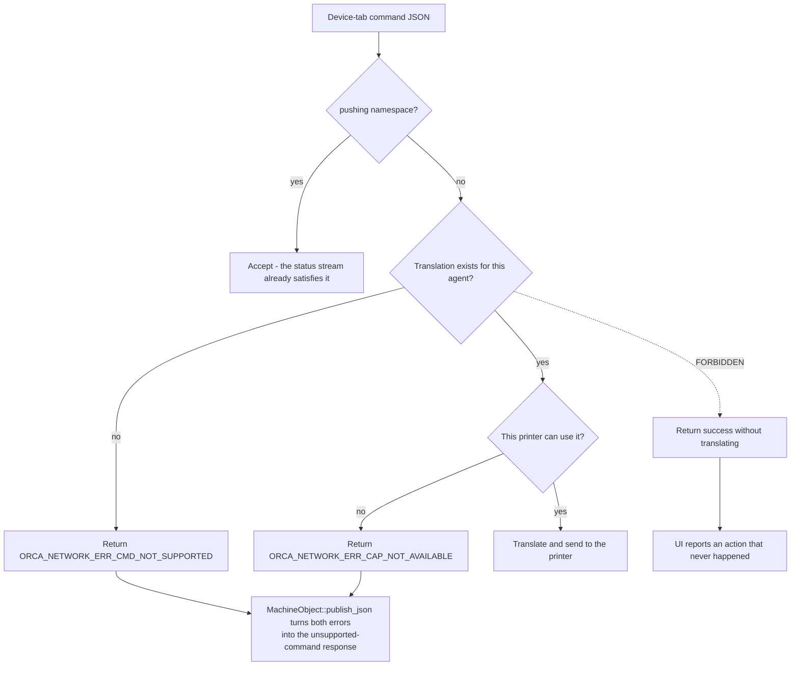

# Architecture

*Owns the structural rules: what the objects are, who owns them, what an
agent must implement, and which behaviors are compatibility contracts.
Defers the runtime sequence - selecting, connecting, receiving status,
sending commands - to [Connection and status](connection-and-status.md).*

## The compatibility boundary

The Device tab was built around Bambu-style commands and status. A printer
agent is the translation boundary between that existing contract and a
vendor's native protocol:

```text
Device tab <-> MachineObject <-> NetworkAgent <-> IPrinterAgent
                                            <-> vendor protocol
```

Note: end goal is to move beyond this and achieve a truly vendor-neutral translation layer.

The GUI builds commands and reads `MachineObject` state. An agent owns the
vendor request, response, connection, and status translation. Keep vendor
details on the agent side of this boundary.

Status translation is deliberately Bambu-shaped. Agents deliver payloads
through the callbacks used by the existing Bambu path, and
`MachineObject::parse_json()` interprets them. This preserves the Device
tab's established behavior, but it is not a vendor-neutral protocol.

Important (again): end goal is to move beyond this and achieve a truly vendor-neutral translation layer.

## Runtime objects and ownership

`NetworkAgent` is the facade used by the application. It holds one live
`IPrinterAgent` pointer, which is initially null and may return to null
when a selected ID is unavailable. Callers must handle the null case. An
absent agent is an inert state, not permission to fall back to another
printer agent. A fallback would connect to a different implementation than
the one selected by the preset, and could therefore send commands or status
work to the wrong printer.

`NetworkAgentFactory` registers built-in and plugin implementations by
agent ID. It creates and caches one implementation for each ID. The ID
selects a printer agent implementation, while a `MachineObject` selects one
printer by device ID. The resulting cardinality is one active agent to many
machines.

For example, suppose two Moonraker printers are on the LAN at
`192.168.1.20` and `192.168.1.21`. In the Device tab machine-select popup, the
user chooses **Bind with Access Code**; `PinCodePanel::on_mouse_left_up` opens
`InputIpAddressDialog`, and each entered address is bound as a separate
printer. Both presets store the same agent ID, `moonraker`, so
`NetworkAgentFactory::create_printer_agent_by_id` returns the same cached
`IPrinterAgent` pointer for both presets. Each printer nevertheless has its
own `MachineObject` and device ID. For the Moonraker family,
`MoonrakerPrinterAgent::bind_detect` calls `init_device_info` with the entered
address as both the device ID and address, so the two device IDs are the two
addresses.

That is what one active agent to many machines means. Per-printer state must
be keyed by device ID rather than held only on the agent instance, because one
agent object is shared by both printers. State stored only on that object
would be shared between two different machines and could route status or
commands to the wrong one. The same sharing explains why
`GUI_App::switch_printer_agent` compares device IDs even when the agent pointer
is unchanged: otherwise its unchanged-agent early return would skip
reselection when the user switches between these presets, leaving status and
filament work aimed at the previous printer.

> **Do not make an agent instance per printer just to hold device state.**
> Keep per-printer state keyed by device ID, because one agent object is
> shared by every printer of that type - state held on the instance would
> route status or commands to the wrong `MachineObject`.

> **Do not fall back to another printer agent when the live one is null.**
> An absent agent is an inert state. A fallback would connect to a
> different implementation than the preset selected.

## Commands and unsupported work

An agent must either translate a Device-tab command or return an explicit
error. `ORCA_NETWORK_ERR_CMD_NOT_SUPPORTED` means no translation exists.
`ORCA_NETWORK_ERR_CAP_NOT_AVAILABLE` means a translation exists but this
printer cannot use it. `MachineObject::publish_json()` turns either result
into the user-visible unsupported-command response.

Every Device-tab command must leave by one of these four exits. The fifth
path is the one to watch for in review:



> **Do not return success for an unhandled command.** That makes an
> unsupported button look as though it worked and hides missing coverage
> from both users and maintainers.

The `pushing` command namespace is the exception. Its request means
"send status"; an active status stream already satisfies it. The Device
Manager sends these requests repeatedly as a keepalive, so rejecting them
would surface a warning repeatedly even though no action is missing.

## Feature gate

`use_printer_agents` enables printer-agent routing. With the gate off,
agent code must have no observable effect. Released profiles can already
contain `printer_agent` values, so activating an agent while the gate is
off would change existing user behavior merely by loading a profile.

Keep the gate at the routing call sites. Do not fold it into general Bambu
vendor checks: slicing and hardware decisions such as AMS, lidar, bed
types, and G-code flavor still describe printer capabilities, not the
selected printer agent.

## Backward compatibility

`printer_agent` remains a `coString`, even when the ID is currently
unregistered. A preset may refer to an optional plugin that is not
installed. The unknown string must load, remain unchanged, and round-trip
without making the preset dirty. The UI may show it as missing, but must
not rewrite it to a fallback ID.

Keep the feature gate's off-path behavior unchanged, preserve stored agent
IDs, and treat Bambu-shaped payloads as a compatibility contract.

The reason these three are grouped is that each looks like a local code
change and is not. Switching which printer agent handles a preset edits no
profile and no project file, so it reads in review as contained to the
agent layer. But a user's stored presets and `.3mf` projects already carry
`printer_agent` values and were saved against the Bambu-shaped payload. So
a change that is local in the code is not local in effect: it reaches
every previously saved file. That is why the gate must be inert when off,
an unknown ID must survive untouched, and the payload shape is treated as
a contract rather than an implementation detail.

## Threading rule

Agents may perform network work on their own threads, but all mutations of
Device Manager maps and `MachineObject` UI state must run on the UI thread.
Queue incoming status before it reaches `parse_json()` or any operation
that adds, removes, selects, or changes a device. This prevents races
between background network callbacks and UI reads. For example, when a status
callback arrives on an agent's network thread, queue it to the UI thread
before it reaches `MachineObject::parse_json()` or changes a device map or
selection. The Device tab reads those same structures on the UI thread, so
parsing or adding, removing, or selecting a device from the network thread
could race with that read.
