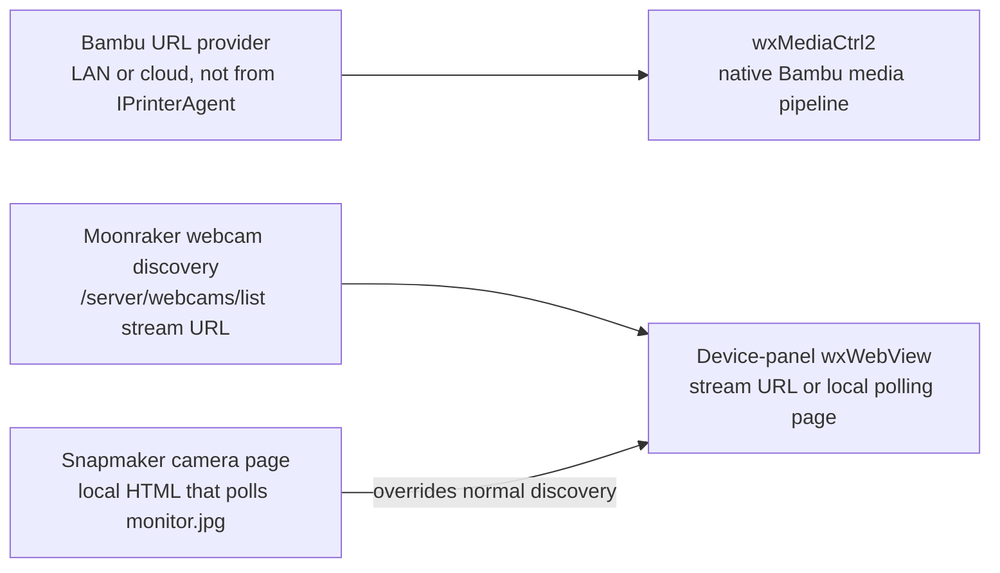

# Camera support

*Owns the three camera ownership models and what each one renders through.
Defers the Snapmaker filament path to [Built-in agents](agents.md), even
though the same subclass owns both.*

Camera support has three ownership models. They share the Device panel,
but not a common frame or stream interface.

Two render surfaces, never one:

## Bambu

Bambu playback uses `wxMediaCtrl2` and the native Bambu media pipeline.
The URL comes from the Bambu LAN or cloud path, not from
`IPrinterAgent`. A printer agent should not attempt to force a Bambu URL
through the Moonraker or WebView path.

## Moonraker live view

On connection, the Moonraker agent obtains the first enabled webcam URL
from `/server/webcams/list`. An absolute HTTP URL is used directly. A
relative URL is resolved against the printer's host web root, with the
Moonraker API port removed. This is necessary because a relative webcam
path may exist on the printer's web server but not on the API port.

The connection generation guards the result. A late request must not
replace the URL after the user has selected a different printer. Failed
discovery clears the URL, which prevents a prior camera from remaining
visible on a printer with no camera.

The agent places the discovered URL in its status payload. The Device
panel renders it in `wxWebView`. It reloads only when the URL changes and
resets the camera-start timestamp at that point. Reloading every update
would loop indefinitely for endpoints that redirect, so an unchanged URL
is shown again without calling `LoadURL()`.

The trade-off is intentional: a WebView that loses an unchanged stream
does not automatically reload. Camera controls beyond live viewing remain
out of scope for Moonraker. Recording, timelapse, settings, and virtual
camera are Bambu-oriented features and must not be presented as supported
merely because live view works.

## Snapmaker polling view

Snapmaker overrides normal webcam discovery. It writes a per-printer local
HTML page that polls the printer's `monitor.jpg` with a cache-busting URL.
Each next request starts after the prior image loads or fails, preventing
requests from piling up on a slow printer. A raw snapshot URL is not used,
because it would display one frozen frame instead of a live-looking view.

The printer must be asked to start its camera capture task. While the
camera view is visible, the Device panel requests this at first display
and then attempts another request every 300 seconds. Other agents reject
the command quietly, so the common timer does not create an error for
Bambu or ordinary Moonraker.

The Snapmaker command is sent from a detached thread because the request
can block on socket I/O and the printer responds over a different channel.
This avoids blocking the UI but leaves a raw-`this` lifetime risk: the
agent can be destroyed while the detached operation still refers to it.
Do not extend this path without addressing that ownership boundary.

The wrapper is written below the application cache with a name derived from
the printer IP. The source contains no cleanup path for those files, so they
can accumulate as different printer IPs are used. This is source-derived and
was not reproduced during this rewrite.

Source code proves 300-second renewal attempts only. The long-running
behavior of the shipped polling and renewal cycle has not yet been tested.
Do not claim that the attempt renews an active capture task or that it
prevents camera expiry until hardware verification establishes both.

## Maintenance checklist

- Keep the three ownership models separate.
- Preserve host-root resolution for relative Moonraker URLs.
- Keep generation guards and stale-URL clearing on every discovery path.
- Reload WebView content only after a URL change.
- Reset the camera-start timestamp when the camera URL changes.
- Treat Moonraker as live-view-only and Snapmaker lifecycle behavior as
  not yet verified beyond the observed renewal attempts.
