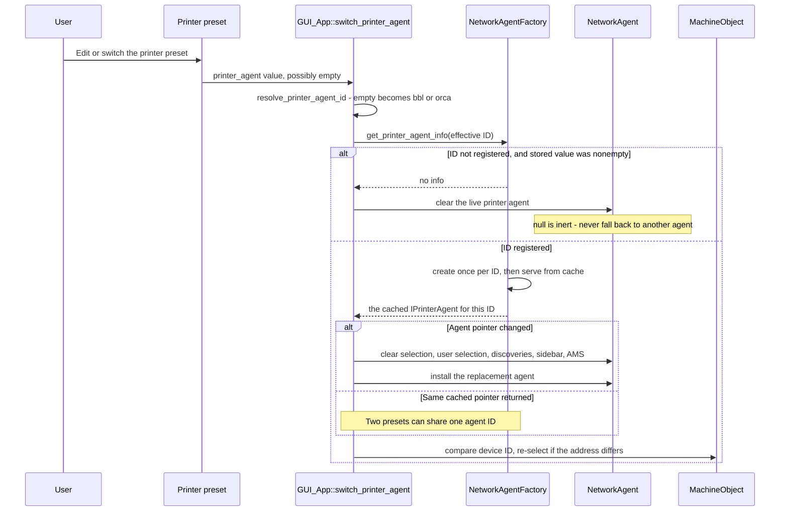
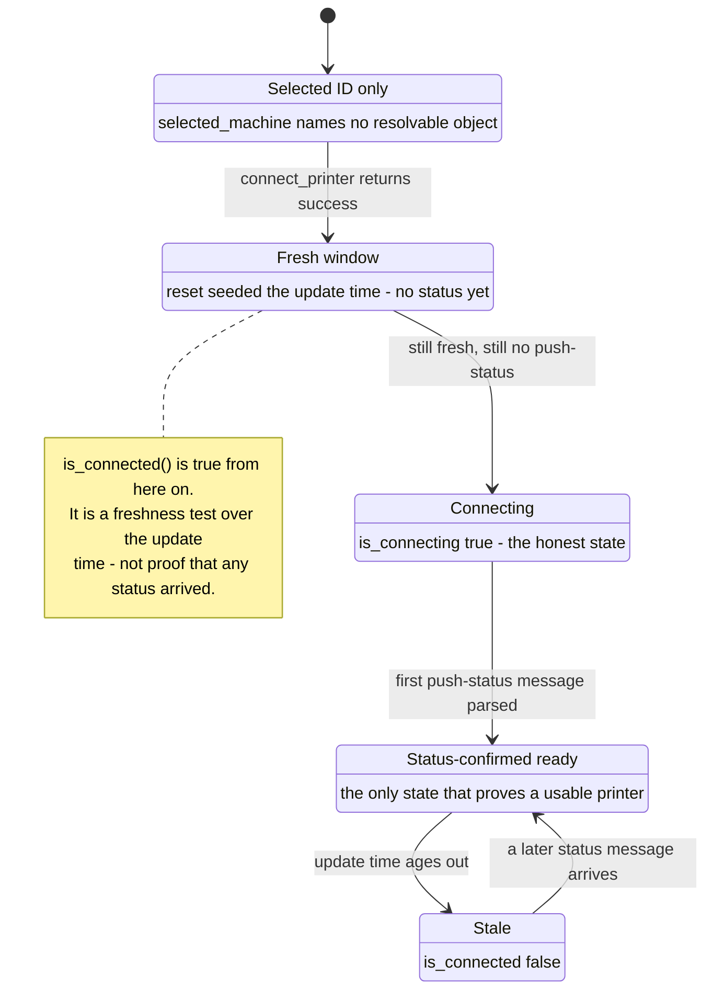

# Connection and status

*Owns the runtime sequence in order: selecting an agent and machine,
starting a connection, receiving status, sending commands. Defers the
structural rules those steps must obey - ownership, no-fallback, unknown
IDs, threading - to [Architecture](architecture.md), and cites them at the
point where they bite.*

## The four runtime concepts

Keep these concepts separate when tracing a connection problem:

- A preset stores an agent ID and printer address.
- `NetworkAgent` holds the active printer agent for that agent ID.
- `MachineObject` represents the selected printer at that address.
- Freshness and status-confirmed readiness are separate states.

An agent ID selects a printer agent implementation. A device ID selects one
printer within that implementation.

A non-Bambu printer reaches the machine list through **Bind with Access
Code**, the tile in the Device tab's machine-select popup. The user enters
an address and an access code, `bind_detect()` probes the address before
any connect, and `DeviceManager::insert_local_device()` creates the
`MachineObject`. For the Moonraker family the address itself becomes the
device ID: `MoonrakerPrinterAgent::bind_detect()` seeds `dev_name` and
`dev_id` from the entered address, so an unreachable or unnamed printer
still shows up as its IP rather than blank.

Binding is the only route for that family. `MoonrakerPrinterAgent::start_discovery()`
deliberately announces nothing, because a partial discovery implementation
would populate the machine list with stale hosts. Bambu is the exception:
it has its own discovery identity and does not use the address as an ID.

`DeviceManager::selected_machine` is only a selected ID. It can name no
resolvable object. `get_selected_machine()` answers whether an object is
actually available. `set_selected_machine()` accepting an ID therefore
does not prove the printer is connected. The selected ID can remain when its
object is unavailable, so connection state must come from the object itself.

## Selecting the agent and machine

`GUI_App::switch_printer_agent()` reads the edited printer preset and
resolves its stored agent ID through `NetworkAgentFactory`.

1. An empty stored ID is a legacy sentinel. It resolves to `bbl` for a
   Bambu vendor preset and to `orca` otherwise.
2. If that effective ID is registered, the factory provides the matching
   printer agent implementation.
3. Clear the live printer agent only when a nonempty stored ID is unregistered
   or the factory cannot construct the matching registered agent.
4. When the active printer agent changes, clear the current selection, user
   selection, stale device discoveries, sidebar state, and AMS state before
   installing the replacement.
5. Select the preset's address-derived machine for non-Bambu agents.

The lifetimes are easier to see than to read. Note that the agent pointer
can be unchanged while the machine still must be re-selected - that is the
trap in the same-agent path below:

> **Do not use the first available machine as a fallback** (rule owned by
> [Architecture](architecture.md), Runtime objects and ownership). It
> connects to a printer the user did not choose, including one owned by a
> different printer agent.

The same-agent path is important too. Two presets can use one agent type
but point at different addresses, and the factory caches one agent per ID,
so switching between them returns the same pointer and would otherwise
skip reselection entirely. Re-select the machine whenever the preset's
address changes, even when the factory returned the same active agent.
Otherwise status and filament work can continue against the previous
printer.

Note: this is a legacy coupling, not the primary workflow. It reads an
address stored on the printer preset itself (`print_host` and
`printhost_port`, named here only so the keys can be found in the code)
and derives a device ID from it with `dev_id_from_address()`. Those keys
predate printer agents and are edited through `PhysicalPrinterDialog`,
which despite its name writes the printer preset rather than a
`PhysicalPrinter` object - that object is no longer constructed. Printers
normally arrive through Bind with Access Code instead, which does not
touch the preset. Both routes end at `insert_local_device()`, so they must
agree on the device ID: `dev_id_from_address()` strips the URL scheme and
drops an empty port, while the bind path stores the address as the user
typed it.

The unknown-`coString` compatibility rule belongs to `architecture.md` under
Backward compatibility. Keep a nonempty unknown `printer_agent` ID unchanged
and display a missing state if needed; do not rewrite it during plugin unload
or choose an arbitrary replacement, so the preset can round-trip while its
plugin is temporarily unavailable.

## Starting a connection

Machine selection causes `MachineObject::connect()` to invoke the active
agent's `connect_printer()` with the selected address and effective access
code. A success return means that the connection attempt started. It does
not mean that the printer is ready or that a status stream is alive.

Moonraker-family agents must force HTTP. Moonraker and print-host
installations commonly serve plain HTTP, while the generic machine path
can request TLS by default. Passing that default through turns a valid
connection into an HTTPS request the printer will refuse. The agent therefore
must keep the connection on HTTP unless its protocol support changes
deliberately and is verified.

## Access codes: four coordinated slots

One effective access code can live in four places:

| Slot | Location | Purpose |
| --- | --- | --- |
| Device runtime | `MachineObject::access_code` | Code learned from the device. |
| User runtime | `MachineObject::user_access_code` | Code entered by the user. |
| Device config | `access_code[dev_id]` | Persisted device value. |
| User config | `user_access_code[dev_id]` | Persisted user value. |

The effective code prefers the user value when present, then the device
value. Keep user input in the user path and device replies in the device
path. Crossing those paths obscures which value should win.

`set_access_code()` deliberately does not save configuration immediately.
Device replies and polls can update it often; forcing a full config write
for each message adds unnecessary work. The normal deferred config save
persists dirty state later. Do not add an eager save just to make this one
path symmetric: device replies and polls update it often, so a config
write per message is wasted work.

> **Do not erase the user access code when a printer connects.** On the
> LAN reselection path that code can be the only credential that lets the
> machine pass the access check and receive the status or access-code
> reply that would refresh it, so erasing it at connection time can leave
> the machine permanently unable to receive updates. A failed connection
> is the place to handle a proven bad credential.

## Receiving status

An agent receives native status, translates it to the existing payload
shape, and dispatches it to the matching `MachineObject`. The object
parses the payload and records when it last received an update.

Readiness is four states, and three of them look connected:

`is_connected()` is a freshness test over the update time. It does not
describe whether `connect_printer()` returned success or whether any status
message arrived: reset initializes the update time, creating an initial
freshness window. `is_connecting()` distinguishes that window from
status-confirmed readiness: while the object is fresh and no push-status
message has arrived, it remains connecting.

> **Do not treat freshness or a successful connect as proof of readiness.**
> Code that needs a usable printer must wait for status-confirmed
> readiness, because the fresh window exists before any status has been
> parsed.

The UI-thread mutation rule belongs to `architecture.md` under Threading rule.
Dispatch the status callback to the UI thread before changing device maps,
selection, or `MachineObject` state, because network callbacks may run in a
worker thread and mutating these structures there races with the Device tab.

## Sending commands

`MachineObject` builds the established command JSON and sends it through
the active `NetworkAgent`. The agent translates it or returns an explicit
unsupported result. It must not report success when no translation exists.

The `pushing` command exception belongs to `architecture.md` under Commands
and unsupported work. It asks for status, and a working status stream already
supplies it, so accepting it avoids false unsupported warnings from the Device
Manager's repeated keepalive.

## Maintainer constraints

- Preserve same-agent reselection by address, because an agent type can
  serve more than one printer.
- Preserve the null-agent, no-fallback, and unknown-`coString` rules in
  `architecture.md`; selection must remain an explicit user or preset choice,
  and stale state must not belong to a replacement printer agent.
- An empty value is the legacy Bambu-or-Orca sentinel, not a missing printer
  agent.
- Preserve deferred access-code saves and the no-on-connect-erase rule;
  they prevent excessive config writes and credential-driven status loss.
- Keep Moonraker connections HTTP-only unless the agent's protocol support
  changes deliberately and is verified.
- Do not treat freshness as proof that status arrived; wait for
  status-confirmed readiness. The UI-thread mutation rule is in
  `architecture.md` under Threading rule.
