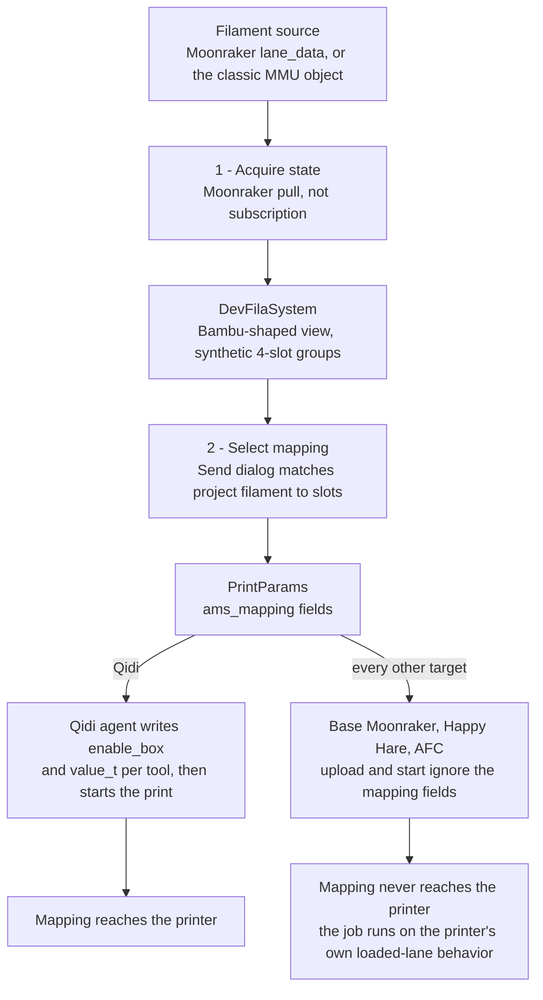

# Filament synchronization and mapping

*Owns the three filament stages end to end: acquiring printer state,
selecting a mapping, and delivering it at print time. Defers the upload
and start mechanics to [Printing](printing.md), and per-vendor discovery
detail to [Built-in agents](agents.md).*

Filament support has three separate stages. A successful first stage does
not mean that a selected mapping will be delivered to the printer.

Stage 3 is where the two paths diverge, and only one of them reaches the
printer:

## 1. Acquire printer state

`FilamentSyncMode` declares how the UI obtains filament state:

| Mode | Meaning |
| --- | --- |
| `subscription` | A status stream keeps the state current. |
| `pull` | The UI must request state before it can use it. |
| `none` | The agent has no usable filament state. |

Moonraker uses `pull`. Its ordinary status stream does not supply the
filament data used by this UI. In particular, `lane_data` is a Moonraker
database namespace, not a printer object that the existing subscription
can follow. Changing Moonraker to `subscription` would suppress the pull
that actually populates the UI.

The agent first reads `lane_data`, which can describe AFC and newer Happy
Hare installations. If that is unavailable, it reads the classic Happy
Hare `mmu` object. Those response shapes are source-supported but not yet
verified against current Happy Hare and AFC installations.

The current parser expects lane values as strings and silently skips
numeric values. Whether current AFC or Happy Hare installations emit
numeric lane values is unverified.

The received lanes are converted into a Bambu-shaped model so existing
AMS UI can render them. The model groups numeric lane indexes into
synthetic groups of four slots and passes the result through
`ParseV1_0`. This is a UI compatibility adapter, not evidence that the
printer has a Bambu AMS.

Pull state can be stale. The Send dialog can build a mapping from the
current `DevFilaSystem` without refreshing it first, and a failed pull can
leave older state visible. Do not represent a displayed lane list as a
fresh printer read unless the call site just performed the pull.

## 2. Select a mapping

The Send dialog matches each project filament to a compatible reported
slot. It rejects a mismatched material type and then prefers compatible
slots according to the existing mapping rules. The result is carried in
the legacy linear mapping, the explicit AMS-and-slot mapping, and mapping
metadata for the job.

Treat lane numbers as printer contracts. A numeric lane index is used as a
slot index in the synthetic four-slot view, so an incorrect numbering
assumption can select the wrong physical lane.

The material identity code also retains a defect: ABS and ASA can be
shown as PLA when profile identifiers collide. This is not fixed here,
and multi-color mapping has not received hardware verification.

## 3. Deliver the mapping at print time

`PrintJob` copies the selected mappings into `PrintParams`, but base
Moonraker does not read those fields when it uploads and starts a print.
For plain Moonraker, Happy Hare, and AFC targets using that base path, a
correct-looking mapping in the UI is therefore not delivered to the
printer. The print runs using the printer's own loaded-lane behavior.

Qidi is the implemented exception. Its agent writes its own box mapping
before starting the print. That is a Qidi-specific delivery contract, not
a generic Moonraker solution.

There are deliberately no guessed Happy Hare or AFC write macros. Their
macro and variable names are defined by printer-side configuration, so a
guessed command could silently do nothing or control the wrong setup. Add
a delivery path only after verifying the exact contract against upstream
documentation or a real printer.

## Maintenance checklist

- Keep Moonraker in `pull` mode while `lane_data` remains pull-only.
- Refresh or clearly surface stale state before relying on Send-dialog
  mappings.
- Do not claim base Moonraker honors mappings until it consumes them at
  print time.
- Preserve Qidi as a distinct delivery implementation.
- Verify lane numbering, material identity, and multi-color behavior on
  hardware before expanding the mapping contract.
