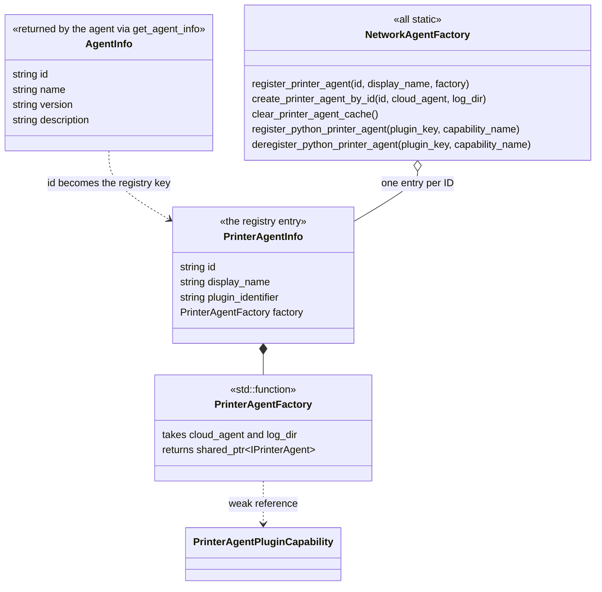

# Python printer-agent plugins

*Owns the plugin bridge: the implementation contract, registration and
lifetime, and the audit scope. Defers what the agent must do once live to
[Architecture](architecture.md) and
[Connection and status](connection-and-status.md).*

Python printer agents use the current capability bridge. They do not use a
separate adapter or a Moonraker-specific plugin path.

## What an agent must implement

Not overriding a member of `IPrinterAgent` has four different
consequences depending on which tier it is in. This is the whole plugin
contract:

| Tier | Members | Consequence of not overriding |
| --- | --- | --- |
| Pure virtual | `connect_printer`, `disconnect_printer`, `send_message_to_printer`, the `start_*` print operations, `start_discovery`, `bind`, `bind_detect`, `unbind`, the callback setters, `set_cloud_agent`, `get_agent_info`, and the rest of the pure surface | Compile error |
| Concrete, succeeds | `start_subscribe`, `stop_subscribe`, `add_subscribe`, `del_subscribe` | Silently returns `BAMBU_NETWORK_SUCCESS` |
| Concrete, declines | `command_ams_refresh_rfid`, `command_ams_calibrate`, `command_ams_select_tray`, `command_start_camera` | Silently returns `ORCA_NETWORK_ERR_CMD_NOT_SUPPORTED` |
| Concrete, inert | `get_filament_sync_mode`, `fetch_filament_info` | Reports `FilamentSyncMode::none` and `false` - no filament capability at all |

The refusal tier is deliberate: those commands carry Bambu-dialect G-code
in their bodies, so the honest default is a refusal that
`MachineObject::publish_json()` turns into a dialog. The success tier is
equally deliberate - a printer whose status already streams needs no
subscription call.

> **Do not assume a missing override quietly inherits useful behavior, and
> do not assume it fails loudly either.** Only the first tier fails at
> compile time. The second silently reports success, the third silently
> declines, and the fourth silently reports no filament capability.

## The plugin contract

A plugin subclasses `printer_agent.PrinterAgentBase`, the Python binding for
`PrinterAgentPluginCapability`. The capability itself is the live native
`IPrinterAgent`; there is no intermediate protocol adapter, because
`PrinterAgentPluginCapability` inherits both `PluginCapabilityInterface`
and `IPrinterAgent` directly.

`get_type()` stays a `PluginCapabilityInterface` method and
`set_cloud_agent()` remains the native host injection point. A plugin must
implement the pure connection, communication, discovery, binding, print,
callback-registration, and filament-refresh operations. The certificate,
bind-ticket, HMS-snapshot, and user-selected-machine members are pure too;
the table above abridges the list.

The only tracked Python printer-agent implementation is the BBL plugin. There
is no Python Moonraker printer agent in the current source tree. Moonraker is
implemented by the built-in C++ class.

## Registration and lifetime

When an enabled plugin advertises a printer-connection capability, the factory
gets its `AgentInfo` and registers a factory under `AgentInfo.id`. This is the
same registry used for built-in agents.

Two similarly named structs are involved, and they are not the same thing.
`AgentInfo` is what the agent says about itself; `PrinterAgentInfo` is the
registry's entry about it:

`plugin_identifier` is empty for built-ins and
`<plugin_key>;<uuid>;<capability_name>` for plugins - that is how the
registry tells the two apart at deregistration time. Built-in IDs are the
constants `ORCA_PRINTER_AGENT_ID` and `BBL_PRINTER_AGENT_ID`.

Agent IDs are global. A plugin cannot replace a built-in agent or another
plugin with the same ID. Registry rejection is unconditional. The conflicting
capability is disabled and the user is shown the conflict only when `wxTheApp`
exists and the app is not closing. Re-registering the same plugin capability
is allowed so a reload can replace its factory with the current capability
instance.

The registered factory holds a weak reference to the capability. If the plugin
has already gone away, creation returns null instead of reviving a destroyed
Python object. Callers must treat that as no active printer agent.

On deregistration, the factory removes the registry entry and cached agent,
disconnects a cached agent, and clears the live agent if it has the same ID.
This order prevents `NetworkAgent` from retaining a Python implementation
whose module is about to unload. The current path is UI-thread oriented. Raw
pointer hazards become relevant only if deregistration moves to another thread
without adding synchronization around the GUI-held active-agent handle.

## Device-tab integration

Plugins share the native Device tab with built-in agents. There is no
printer-agent API for adding custom Device-tab panels and no plugin-owned
`MachineObject` to populate directly.

Instead, the plugin supplies the same callbacks as any `IPrinterAgent`. Its
status messages must use the Bambu-shaped payload that `MachineObject` already
parses. If a required field is absent, the shared native UI shows its default
or incomplete state. A custom protocol is acceptable inside the plugin, but
its boundary with the app must perform this translation.

## Python calls, errors, and audit scope

The C++ trampoline acquires the Python GIL, invokes each pure virtual override,
logs a Python exception, and rethrows it. A missing override is a separate
C++ pure-virtual failure, not a logged Python traceback. Python construction
also bypasses the virtual trampoline, so the bridge logs a constructor failure
at the construction boundary.

Plugin-created threads need their own exception handling. An exception raised
there does not cross the C++ trampoline; it reaches Python's thread exception
handling and is recorded through redirected Python standard error.

The audit hook is defense in depth, not a sandbox. Current printer-agent
trampoline calls use loading audit mode. In that mode, normal reads are
allowed, only some file writes are checked against allowed roots, and many
operations are outside the policy, including network access and process
creation. Work that runs outside an active trampoline scope, including a
plugin-created thread, has no attributed plugin context and is allowed by
default. Do not treat this mechanism as permission to run untrusted code.

## Source locations

- `src/slic3r/plugin/pluginTypes/printerAgent/PrinterAgentPluginCapability.hpp`
- `src/slic3r/plugin/pluginTypes/printerAgent/`
  `PrinterAgentPluginCapabilityTrampoline.hpp`
- `src/slic3r/Utils/NetworkAgentFactory.cpp`
- `resources/orca_plugins/BBLPrinterAgentPlugin.py`
