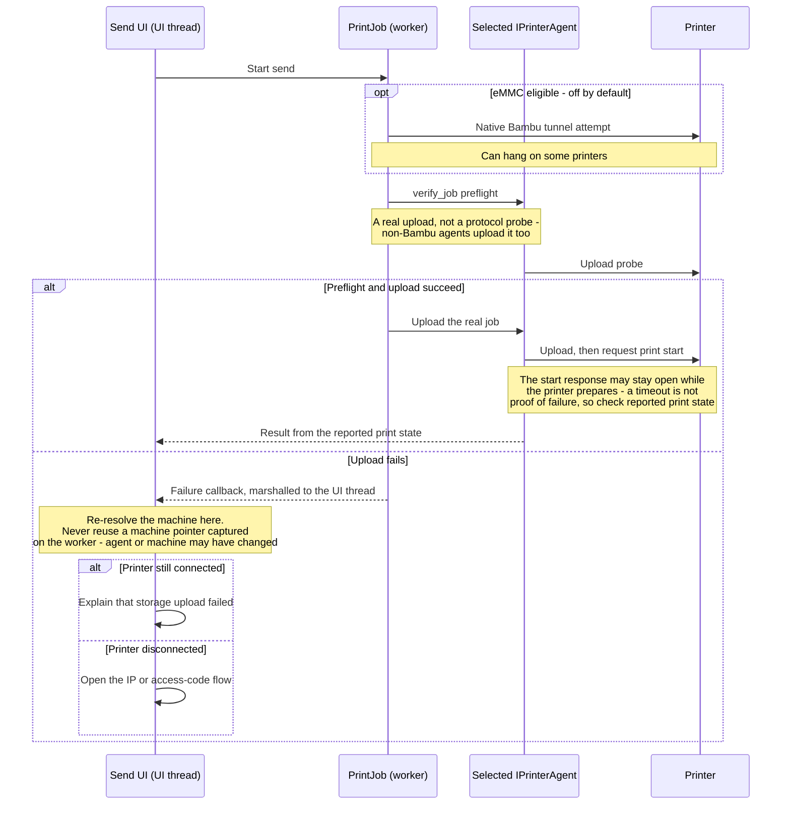

# Printing through printer agents

*Owns the send path: connection choices, preflight, upload, start, and the
two recovery flows. Defers filament mapping delivery to
[Filament synchronization](filament.md), which is a separate contract even
though it is applied at print time.*

This chapter describes the printer-agent send path. It is separate from
the older print-host implementation, even when both target Moonraker.
Keep the paths separate unless their contracts and failure handling can
be deliberately reconciled.

## Connection choices

Three connection paths are in use:

| Target | Connection path | Use |
| --- | --- | --- |
| Native Bambu | Custom TLS tunnel on port 6000 | Send and optional eMMC preflight |
| Bambu Python agent | Implicit FTPS on port 990 | Upload and Bambu preflight fallback |
| Moonraker family | HTTP | Upload and start print |

The Bambu connection paths are independent. Selecting one does not prove that
the other is available. The Moonraker agent uploads with a multipart
request to its `gcodes` storage and then starts the uploaded filename;
it does not reuse the legacy `Moonraker` print-host class.

## Bambu native tunnel

The native tunnel depends on the versioned networking DLL and its
file-transfer module. `InitFTModule()` is a single-owner initialization:
it rejects a second call. Any future shared initialization must therefore
be idempotent, while `BBLNetworkPlugin` remains the single teardown owner.
It must call `UnloadFTModule()` before freeing the DLL, otherwise the
module's function pointers can point into unloaded code.

There is currently an initialization gap: selecting a printer agent does
not initialize this module. It is initialized only when the
`installed_networking` option causes the native BBL network plugin to
initialize. Calls to the tunnel must continue to fail safely until that
path has initialized the module. The Send UI catches this failure and
reports an initialization error instead of letting an exception leave a
wx event handler.

## Bambu FTPS upload

The Python Bambu agent uses implicit FTPS on port 990. Its live upload
path closes the data connection, then waits at most two seconds for the
control response with `voidresp()`. A `TimeoutError` is accepted as a
completed transfer. An `error_reply` is also accepted when its reply
begins with `200`. This is the behavior to preserve.

Do not describe the path as using TLS `unwrap()`: the live construction
does not enable it. Enabling it without a bounded wait could hang while
waiting for the peer's TLS close notification. The current timeout-based
handling has not been verified on hardware against every printer and FTP
server combination.

## Print preflight and recovery

For normal LAN prints, `PrintJob` performs a preflight before the real
send. When eMMC is eligible it tries the native tunnel, then it sends a
small `verify_job` upload through the selected agent. The latter is a real
upload, not a special protocol command. Non-Bambu agents therefore upload
the probe too.

> **Do not re-enable eMMC by default** without hardware coverage for the
> affected devices. It is opt-in because the tunnel can hang during upload
> on some printers.

The whole send, including the thread hop and the recovery fork:

An upload failure and a disconnected printer need different recovery:

| Condition | UI response |
| --- | --- |
| Printer is still connected | Explain that storage upload failed. |
| Printer is disconnected | Open the IP or access-code flow. |

> **Do not retain a machine pointer from a worker callback.** The callback
> that chooses between these two outcomes runs on the UI thread and
> re-resolves the machine there, because the selected agent or machine can
> change first. The connection check is adequate for choosing the message,
> but is not a strong enough signal to authorize a reconnect.

## Moonraker upload and start

`MoonrakerPrinterAgent` uploads through Moonraker HTTP, then requests the
print start separately. The start endpoint may keep its response open
while the printer prepares the job. A timeout after that request is not
automatically proof that the start failed: the agent checks the reported
print state before deciding the result.

The legacy print-host Moonraker path implements its own upload and start
logic. It is not the agent path and should not be changed as an implicit
side effect of agent work.

## Maintenance checklist

- Test the selected connection path, not just another path on the same
  printer.
- Preserve cancellation and progress callbacks across upload and start.
- Treat `verify_job` as an actual upload when estimating storage effects.
- Keep eMMC opt-in until its hanging behavior is resolved and verified.
- Keep the connected-upload-failure dialog distinct from the disconnected
  recovery flow.
